# System Architecture Document — Taksh v0.1
**Voice-Enabled Engineering Mentor with Memory**

---

## 1. System Architecture

Taksh v0.1 is designed as a **local sidecar companion service** that runs directly on the developer's workstation. This architecture maximizes privacy, provides zero-latency access to the local workspace, and enables offline vector and relational databases while leveraging cloud-based, low-latency AI endpoints for audio processing.

The system uses a **WebSocket-proxy orchestration pattern**: the React frontend maintains a single WebSocket connection with the FastAPI backend, which in turn orchestrates RAG, memory layers, and the Skills Engine, managing a persistent secure WebSocket tunnel to the Gemini Multimodal Live API.

### High-Level System Diagram

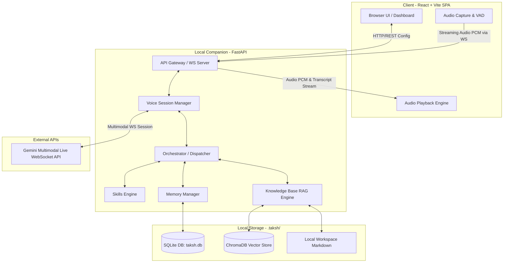

---

## 2. Component Diagram

The internal architecture is divided into decoupled modular boundaries to separate real-time media ingestion from database access, prompt engineering, and state watchers.

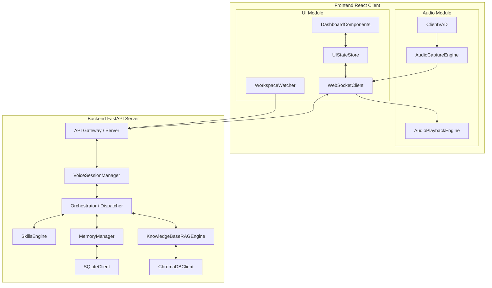

### Component Descriptions

#### Frontend Client
*   **AudioCaptureEngine**: Configures browser media devices, captures microphone input, and downsamples raw audio to 16kHz 16-bit mono PCM.
*   **AudioPlaybackEngine**: Coordinates playing raw PCM chunks received from the backend, manages an audio jitter buffer, and controls immediate audio queue flushes.
*   **ClientVAD**: Runs a lightweight voice activity detection algorithm (e.g., via `silero-vad` or Web Audio API Analyzer) in a web worker to detect speech boundaries, ensuring audio is only streamed when the user is speaking.
*   **WebSocketClient**: Handles connection state, reconnection logic, and routing of audio packets and JSON control messages.
*   **WorkspaceWatcher**: Emits periodic telemetry containing the user's active file, selection ranges, cursor positions, and terminal build failure traces.
*   **UIStateStore & Dashboard**: Manages UI modes (*Listening*, *Thinking*, *Speaking*, *Idle*) and displays the active conversation transcripts, long-term memory logs, and tasks.

#### Backend FastAPI Server
*   **API Gateway & VoiceSessionManager**: Exposes REST interfaces and acts as the entry point for WebSocket streams. Manages the connection lifecycle and proxying to external cloud endpoints.
*   **Orchestrator / Dispatcher**: Intercepts events, schedules database lookups, executes the Skills Engine, coordinates RAG, and builds the payload injected into the streaming LLM channel.
*   **SkillsEngine**: Loads specialized developer personas and executes prompt overlay mapping based on active context.
*   **MemoryManager**: Coordinates CRUD operations across SQLite, ChromaDB, and the immutable local Core Identity Memory.
*   **KnowledgeBaseRAGEngine**: Processes local workspace markdown files, generates embeddings, and queries ChromaDB for semantic retrieval.

---

## 3. Data Flow

The data flow highlights the lifecycle of a single voice query, demonstrating how memory retrieval, vector knowledge base searches, and the skills registry are executed before triggering the persistent LLM session, alongside how voice interruptions are handled.

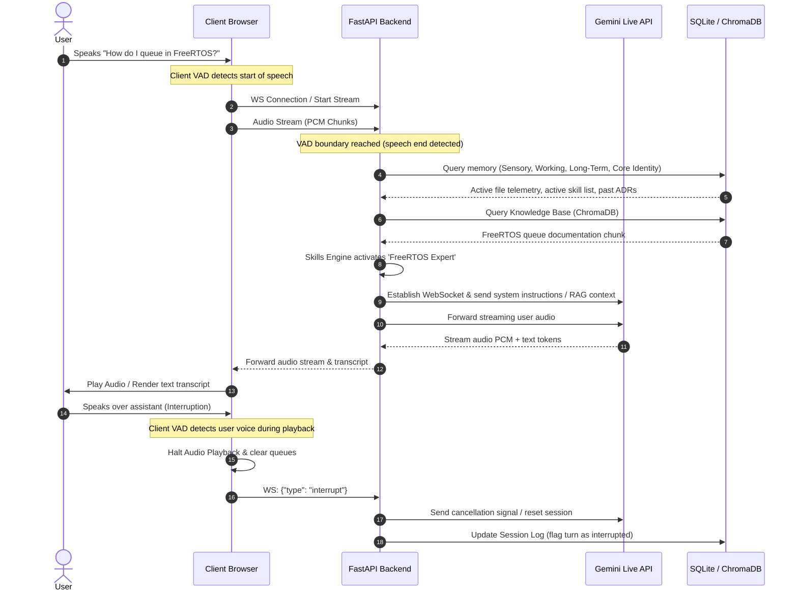

---

## 4. Memory Architecture

Taksh implements a **4-tier hierarchical memory model** to maintain contextual continuity while managing token limits and avoiding context drift.

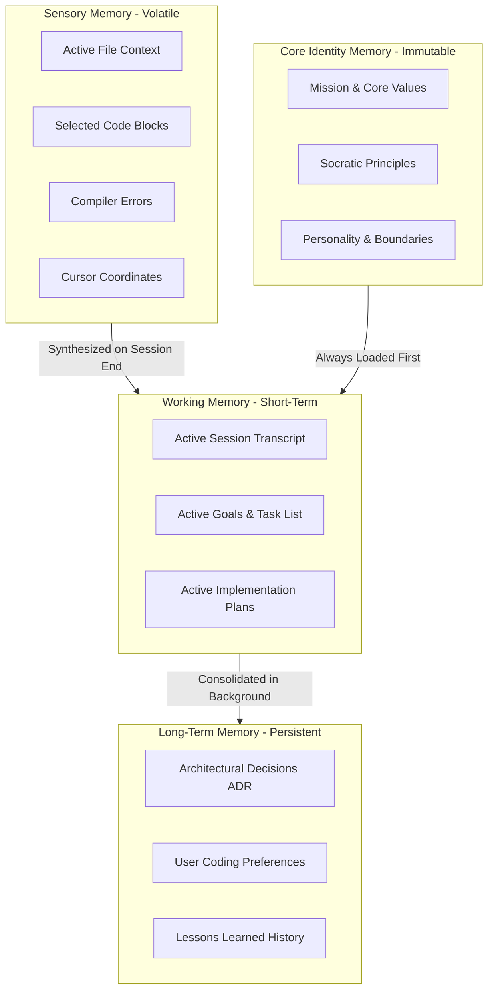

### Memory Tier Specifications

| Memory Tier | Storage Backend | Lifetime | Contents | Pruning / Consolidation Policy |
| :--- | :--- | :--- | :--- | :--- |
| **Sensory** | In-Memory (Python Dict) | Active session cycle (volatile) | Open file buffers, cursor lines, IDE selections, stack traces | Discarded upon session termination. |
| **Working** | SQLite / Local File (`task.md`) | Single engineering task lifecycle | Conversational context, checked/unchecked tasks, implementation plans | Archived to session logs on session close. |
| **Long-Term** | ChromaDB & SQLite (`taksh.db`) | Months / Years (Persistent) | Historical design debates, codebase architecture rules, developer profile | **Consolidation Pipeline**: Nightly background task processes logs, removes duplicates, and updates a semantic index. |
| **Core Identity** | Read-Only Markdown (`core_identity.md`) | Permanent | Mission, pedagogical principles, personality parameters, boundaries | **Strict Policy**: Never compressed, never pruned, never modified by LLM, always loaded. |

---

## 5. Core Identity Architecture

To ensure Taksh maintains an invariant personality and pedagogical baseline across all interactions, a dedicated **Core Identity Layer** is established. This layer is isolated from user memory, RAG indexes, and dynamic models, operating as a read-only foundation.

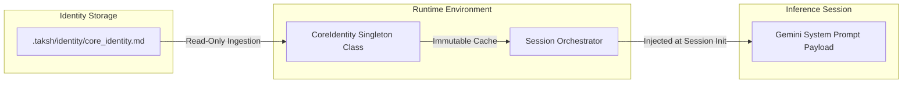

### Identity Model
The identity model is defined declaratively using a structured markdown schema. It specifies Taksh's foundational role, values, and strict boundaries:
*   **Pedagogical Directive**: Always guide the developer towards understanding first principles. Avoid direct code generation unless the user demonstrates a conceptual grasp of the problem or has made multiple compilation attempts.
*   **Behavioral Baseline**: Be direct, encourage depth, ask clarifying questions, and respect the engineer's agency.

### Identity Storage Strategy
*   Stored in `.taksh/identity/core_identity.md`.
*   The backend establishes read-only filesystem file permission handles on this directory during initialization to prevent accidental overrides.

### Identity Runtime Architecture
*   Loaded into memory during backend application startup.
*   Parsed into a thread-safe python `Singleton` class (`CoreIdentityManager`).
*   The backend blocks any write API commands pointing to this directory.

### Identity Retrieval Mechanism
*   The raw string content of the Core Identity file is loaded at the start of every connection.
*   It is injected into the root `system_instruction` configuration of the Gemini Multimodal Live WebSocket setup payload, guaranteeing that the model maintains its core behavior throughout the connection lifecycle.

---

## 6. Personality Architecture

Taksh maintains a consistent core identity while adjusting its communication style and level of technical depth using five distinct operational modes.

### Personality Traits & Behavioral Rules
1.  **Pedagogical Rigor**: Respond with questions that push the user to locate root causes instead of immediately offering code fixes.
2.  **Architectural Meticulousness**: Always warn of tight coupling, circular dependencies, or security compromises in proposed solutions.
3.  **Low-Filler Dialogue**: Limit verbal output to key concepts. Code blocks, graphs, and comparative tables must be pushed to the visual dashboard, keeping audio dialogue clean.

### Personality Modes

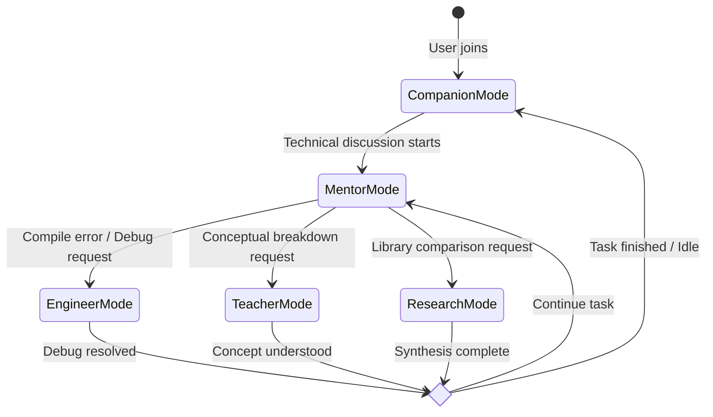

*   **Mentor Mode (Default)**: Leverages active Socratic coaching, asks leading questions, suggests high-level modules, and encourages clean code practices.
*   **Engineer Mode**: Switches to analytical debugging, processes compiler stack traces, suggests exact line modifications, and reviews code structures.
*   **Teacher Mode**: Utilizes architectural analogies, explains design history, and breaks down complex algorithms.
*   **Research Mode**: Triggers multi-step documentation searches, constructs library comparison tables, and highlights licenses and security vulnerabilities.
*   **Companion Mode**: Focuses on encouraging the developer, managing cognitive fatigue during long debug loops, and checking in on long-term task goals.

---

## 7. Relationship Model

To build deep trust and remain relevant over months of usage without becoming repetitive or intrusive, Taksh tracks user progress using a relational schema.

### Relationship Database Schema

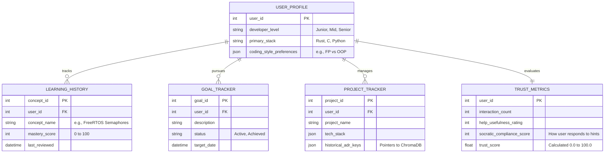

### Relationship Mechanics
*   **Trust Model**: Represents how the assistant adjusts its autonomy. High trust ($T > 75$) grants the assistant permission to suggest complex, pre-scoped design refactors. Low trust ($T < 40$) makes the assistant more conservative, requiring frequent confirmations.
*   **Continuous Learning Integration**: If a developer previously spent three sessions debugging *FreeRTOS queue allocation*, Taksh will reference this context in future sessions rather than explaining the concept from scratch.
*   **Non-Intrusive Continuity**: Long-term memory is queried silently via vector search on the active session topic. If a matching memory exists, it is loaded into the background context. The assistant only references past sessions when it is directly relevant to the current task.

---

## 8. Skills Engine Architecture

The Skills Engine shifts the LLM pipeline from a simple chat response to a structured tool-use workflow.

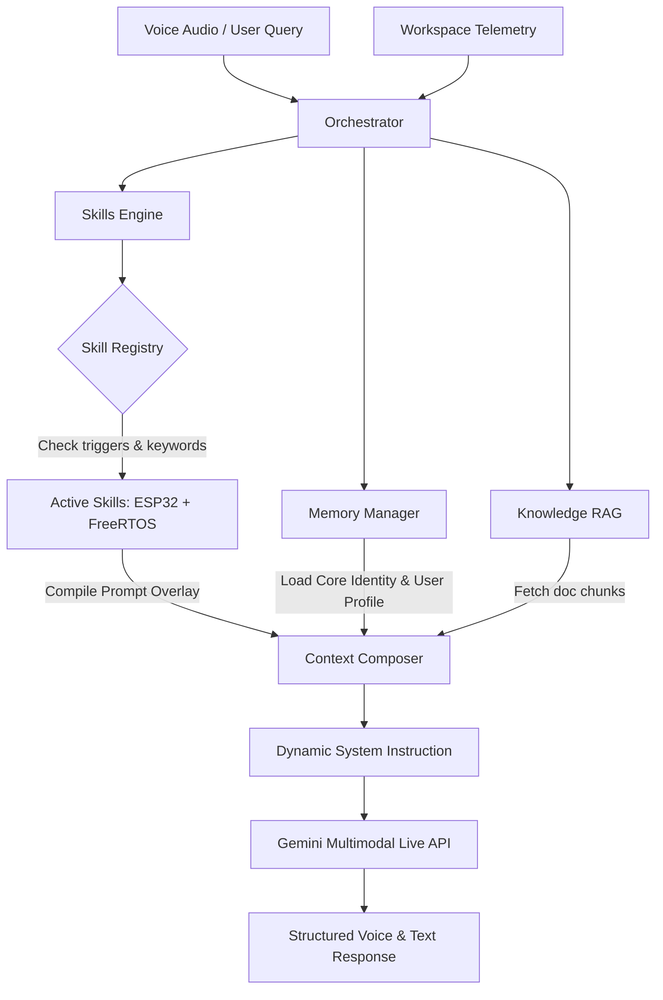

### Skill Registry & Active Skills (v0.1)
The engine loads metadata, prompting templates, and specialized tool interfaces for each skill:
*   **Embedded Architect**: Evaluates low-level resource limits, latency bounds, and hardware constraints.
*   **PCB Reviewer**: Guides high-level schematic checks, trace clearance requirements, and decoupling capacitor placement.
*   **ESP32 Firmware Engineer**: Specializes in ESP-IDF patterns, bootloader behavior, and hardware strapping pins.
*   **FreeRTOS Expert**: Identifies race conditions, deadlocks, task priority inversions, and heap allocation strategies.
*   **IoT Architect**: Analyzes MQTT QoS levels, secure TLS handshakes, data serialization overhead, and OTA strategies.
*   **Django Architect**: Enforces REST/GraphQL best practices, query optimization (N+1 queries), and database isolation.
*   **React Architect**: Guides state management, custom hook structures, components decoupling, and bundle optimization.
*   **Predictive Maintenance Engineer**: Guides vibration anomaly models, DSP sampling rates, and edge inference constraints.
*   **AI Architect**: Guides prompt engineering, vector search strategies, and deployment metrics.
*   **Research Assistant**: Executes multi-turn web search flows, compares software libraries, and verifies licenses.

### Skill Selection & Composition Strategy
1.  **Static Trigger Evaluation**: The Orchestrator monitors the active files in the workspace (sensory memory). For example, finding `sdkconfig` or `#include "freertos/FreeRTOS.h"` automatically registers the *ESP32 Firmware Engineer* and *FreeRTOS Expert* skills.
2.  **Semantic Intent Mapping**: If the user asks "How do we secure the MQTT broker payload?", the semantic classifier matches the query to the *IoT Architect* skill, adding its templates to the session context.
3.  **Collaborative Composition (Blackboard Pattern)**: Active skills write constraints to a shared session blackboard. The Orchestrator combines these constraints. For an IoT device running on an ESP32, the *FreeRTOS Expert* and *IoT Architect* skills combine their instructions, ensuring the generated advice covers both task safety and network efficiency.

---

## 9. Knowledge Architecture

The Knowledge Base houses in-repository documentation, READMEs, architectural decision records (ADRs), and ingested external documentation.

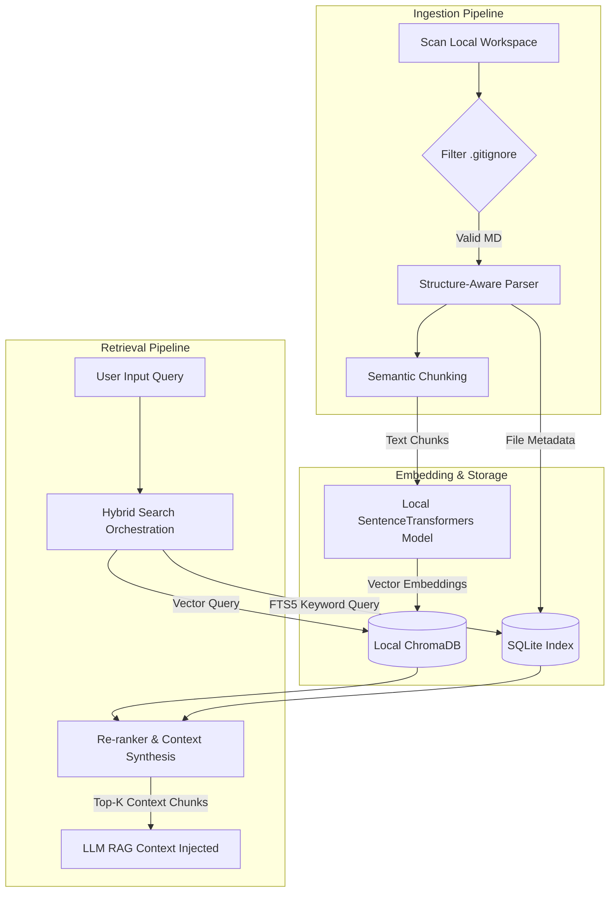

### Chunking and Embedding Specifications
*   **Semantic Chunking**: Documents are split based on markdown structural headers. Each chunk preserves parent header strings to retain structural context. Chunks are capped at 500 tokens with a 10% overlap.
*   **Vector Engine**: Embeddings are generated using a locally-run SentenceTransformers model (e.g., `all-MiniLM-L6-v2`), ensuring complete privacy and offline usability.
*   **Hybrid Retrieval**: Combines ChromaDB semantic similarity search with SQLite FTS5 keyword indexing, ensuring specific code identifiers, system terms, and architectural patterns are retrieved accurately.

---

## 10. Voice Architecture

The Voice Architecture manages real-time, bidirectional voice streaming with sub-second response times and support for natural interruptions.

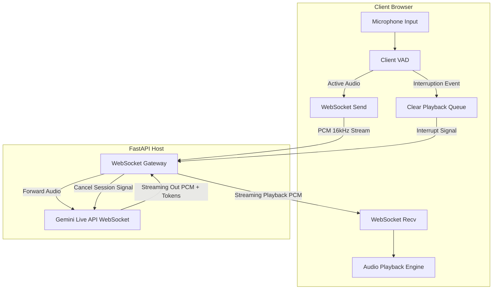

### Voice Pipeline Specifications
*   **Client-Side VAD**: A web assembly instance of Silero VAD runs inside the browser's audio worklet thread. It suppresses silence, ensuring only active voice frames are streamed to the backend.
*   **Streaming Protocol**: The client communicates with the FastAPI backend over a local WebSocket connection (`ws://localhost:8000/api/v1/voice/stream`). The backend proxies the connection to the Gemini Live API over an outbound WebSocket session.
*   **Interruption Handling**:
    1.  If the client VAD detects the user speaking while the assistant is playing audio, it immediately halts playback and flushes the buffer.
    2.  The client transmits a `{"type": "interrupt"}` signal over the WebSocket connection.
    3.  FastAPI receives the signal, sends a session reset/cancel command to the Gemini Live API, and updates the active conversation transcript to mark the assistant's turn as interrupted.

---

## 11. API Architecture

### WebSocket Event Protocol
All communications over `ws://localhost:8000/api/v1/voice/stream` use a structured JSON wrapper for control signals, while binary audio data is sent as raw PCM frames.

#### Client Message Types
*   **Audio Chunks**: Raw binary websocket frames containing 16kHz, 16-bit, mono PCM audio data.
*   **Control JSON Message (Telemetry Update)**:
    ```json
    {
      "type": "telemetry",
      "timestamp": "2026-06-19T12:43:40Z",
      "payload": {
        "active_file": "/src/main.c",
        "cursor_line": 42,
        "selection_empty": true,
        "compiler_error": "conflicting types for 'task_create'"
      }
    }
    ```
*   **Control JSON Message (Interruption)**:
    ```json
    {
      "type": "interrupt",
      "timestamp": "2026-06-19T12:43:42Z"
    }
    ```

#### Server Message Types
*   **Audio Output**: Raw binary websocket frames containing assistant audio chunks.
*   **Control JSON Message (Transcript Segment)**:
    ```json
    {
      "type": "transcript",
      "payload": {
        "text": "It looks like a task creation conflict. Let's check...",
        "is_final": false,
        "role": "assistant"
      }
    }
    ```
*   **Control JSON Message (System State)**:
    ```json
    {
      "type": "state",
      "payload": {
        "status": "thinking", 
        "active_skill": "FreeRTOS Expert"
      }
    }
    ```

### REST API Schema

*   `GET /api/v1/health`: Simple system health check.
*   `GET /api/v1/settings`: Fetches active personality modes, Socratic toggle states, and loaded skills.
*   `POST /api/v1/settings`: Adjusts application parameters (e.g., switching from *Mentor Mode* to *Engineer Mode*).
*   `POST /api/v1/knowledge/ingest`: Triggers a background scan and vector ingestion of the local workspace directory.
*   `GET /api/v1/memory/longterm`: Retrieves a list of saved architectural rules and developer preferences.
*   `DELETE /api/v1/memory/longterm/{id}`: Deletes or prunes a specific long-term memory entry.

---

## 12. Deployment Architecture

Taksh is structured as a **companion application** designed for simple, local installations. The database and index files are self-contained within the developer's project directory.

### Local Workspace Storage Layout

```
.taksh/                          # Project root-level configuration directory
├── taksh.db                     # Relational SQLite database
├── chroma/                      # ChromaDB storage directory
│   ├── chroma.sqlite3
│   └── index_data/
├── memory/                      # Markdown-based session logs
│   ├── session_history/
│   │   ├── session_001_log.md
│   │   └── session_002_log.md
│   └── project_memory.md        # Persistent project long-term memory rules
├── identity/
│   └── core_identity.md         # Read-only Core Identity document
├── logs/                        # Development debug log files
│   └── debug.log
└── knowledge/                   # Ingestion cache and metadata lists
    └── docs_manifest.json
```

### Installation & Execution Architecture
*   **Zero-Container Dependency**: Avoids the use of Docker for the database layer. SQLite and ChromaDB run in-process using Python bindings (`sqlite3` and `chromadb` persistent client).
*   **Local Sidecar Process**: The backend is started by running a local Python environment (`fastapi run app/main.py --port 8000`). The frontend runs in a local browser sandbox, communicating with the backend over `localhost`.
*   **Security Boundary**: The backend only listens on `127.0.0.1` interfaces, preventing unauthorized network access to the workspace and local database.

---

## 13. Future Evolution Architecture

The roadmap outlines the evolution of Taksh from a local, voice-enabled sidecar to an autonomous, cross-repository engineering companion.

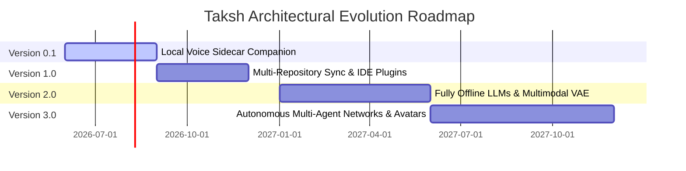

### Evolutionary Roadmap Table

| Vector | Taksh v0.1 | Taksh v1.0 | Taksh v2.0 | Taksh v3.0 |
| :--- | :--- | :--- | :--- | :--- |
| **Primary Capability** | Local voice companion sidecar; RAG for local markdown files. | IDE plugins (VS Code / JetBrains); automated file refactoring. | Fully offline voice modeling; multimodal schematic parsing. | Autonomous multi-agent networks; continuous system auditing. |
| **System Architecture** | Local FastAPI + React web UI. | IDE extension backend + headless service wrapper. | Edge-inference processing pipeline. | Multi-agent orchestrator with blackboard messaging. |
| **Memory Evolution** | In-process SQLite + ChromaDB persistence. | Shared cross-project memory databases. | Hierarchical memory networks with semantic decay. | Fully decentralized memory synchronization. |
| **Skill Evolution** | 10 static developer skills with blackboard composition. | Dynamically downloaded skills; custom DSL for user skills. | Multi-modal visual skills (PCB trace review, UI mocks). | Self-improving skills with automatic code testing. |
| **Voice & Avatar** | Single websocket PCM stream; browser playout. | Native WebRTC audio stream with server-side VAD. | Edge-to-edge voice streaming with natural pause handling. | Real-time interactive 3D visual avatar (WebGL/WebGPU). |
