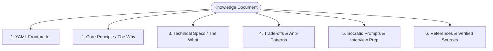
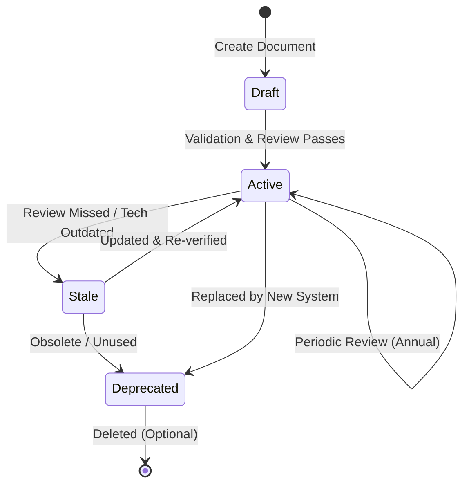

# Taksh Knowledge System Strategy
*(Epistemic Architecture for a Symbiotic Engineering Mentor)*

> [!NOTE]
> This document defines the strategy for organizing, structuring, retrieving, and maintaining the technical knowledge base of **Taksh**. The knowledge system is designed to power Taksh’s **Teacher**, **Mentor**, and **Researcher** facets, bridging first-principles engineering concepts with local codebase context.

---

## 1. Folder Structure & Domain Classification

To maintain high search precision and clean structural boundaries, the knowledge base is divided into logical domain clusters. This folder structure mirrors the physical-to-virtual abstraction layers of modern engineering systems.

```
Knowledge/
├── 00_meta/                      # System-wide standards, schemas, and RAG configuration
│   ├── templates/                # Standard markdown document templates
│   └── taxonomies.json           # Valid metadata tags, domains, and semantic mappings
│
├── 01_electronics/               # Fundamental circuit theory, analog/digital design, passive components
│   ├── circuit_theory/           # Ohm's law, Kirchhoff's laws, impedance, AC/DC analysis
│   └── power_electronics/        # Buck/boost converters, LDOs, power delivery networks (PDN)
│
├── 02_embedded_systems/          # Hardware-agnostic embedded software concepts and architectures
│   ├── memory_mapping/           # Flash, SRAM, Register access, DMA, Cache management
│   └── drivers/                  # Bare-metal peripheral interfacing (GPIO, SPI, I2C, UART)
│
├── 03_freertos/                  # Real-Time Operating System principles
│   ├── task_scheduling/          # Preemption, priority inversion, rate-monotonic scheduling
│   └── synchronization/          # Semaphores, mutexes, queues, event groups, task notifications
│
├── 04_esp32/                     # Espressif system architectures and ESP-IDF development
│   ├── esp_idf/                  # Build systems (CMake), bootloaders, partition tables
│   └── wireless/                 # Wi-Fi stacks, BLE, ESP-NOW, power management profiles
│
├── 05_stm32/                     # STMicroelectronics architectures and bare-metal programming
│   ├── stm32_hal/                # HAL vs. LL drivers, Clock Tree configurations
│   └── dma_adc/                  # High-speed data acquisition, interrupt handling
│
├── 06_iot/                       # Edge-to-cloud architectures, data ingestion, and security
│   ├── edge_gateways/            # Edge translation, data filtering, local persistence
│   └── cloud_integration/        # Device provisioning, digital twins, scalable telemetry
│
├── 07_protocols/                 # Industrial and network communication protocols
│   ├── serial_modbus/            # Modbus RTU/TCP, register mapping, transaction frames
│   ├── telemetry_mqtt/           # Publish-Subscribe, QoS levels, keep-alive, broker topologies
│   └── industrial_opcua/         # OPC-UA address space, information models, client/server nodes
│
├── 08_web_frameworks/            # Full-stack developer reference models
│   ├── backend_django/           # ORM optimization, middleware, REST/GraphQL endpoints, celery tasks
│   └── frontend_react/           # Component lifecycles, state engines (Zustand/Redux), virtual DOM
│
├── 09_ai_agents/                 # Cognitive architectures and agentic systems
│   ├── rag_architectures/        # Vector databases, chunking models, query rewriting, reranking
│   └── planning_engines/         # ReAct loops, state machines, tool use, subagent coordination
│
└── 10_predictive_maintenance/    # Systems health monitoring, diagnostics, and failure modes
    ├── failure_modes/            # FMEA, thermal stresses, wear profiles, MTBF math
    └── signal_processing/        # Vibration analysis (FFT), anomaly detection, sensor analytics
```

### Folder Navigation Rules
1. **Single Responsibility**: Every topic belongs to exactly one domain folder. Cross-domain relationships must be explicitly linked via file paths and metadata dependencies.
2. **Lower Case and Underscores**: All file and folder names must be lowercase with words separated by underscores (e.g., `predictive_maintenance/vibration_analysis.md`).
3. **No Deep Nesting**: Limit the directory structure to a maximum depth of three subfolders (excluding the root `Knowledge/` folder) to prevent directory retrieval degradation.

---

## 2. Document Standards

Every knowledge sheet is written as a structured markdown file (`.md`). Rather than being a simple information dump, documents must be optimized for two distinct consumers: **Taksh’s LLM RAG engine** and the **Human Engineer**.



### Document Sections & Formatting

Every document MUST contain the following sections in order:

#### 1. Title and TL;DR
*   A concise `#` title.
*   A short, high-level summary (maximum 3 sentences) explaining the document's utility.

#### 2. Core Physics / First Principles (The "Why")
*   Explanations must begin with the fundamental laws governing the concept (e.g., Shannon's Theorem for IoT transmission, Kirchhoff's Current Law for circuit designs, or Big-O complexity for algorithms).
*   Use LaTeX equations for mathematical foundations where applicable.

#### 3. Technical Specifications & Reference Implementations
*   Concrete, production-ready code blocks (with explicit language definitions) or register-level schemas.
*   **Zero Placeholders**: Do not write comments like `// TODO: Implement this`. Provide the complete, working block or state the configuration limits explicitly.

#### 4. Architectural Trade-offs & Anti-Patterns
*   A structured table or bulleted list comparing execution alternatives.
*   Explicitly outline common developer pitfalls and anti-patterns (e.g., blocking the FreeRTOS scheduling thread with a standard `delay` function).

#### 5. Socratic coaching prompts ("Grill-Me" Hooks)
*   3 to 5 deep, conceptual questions that Taksh can use to test the user's comprehension during an interactive session.

#### 6. References & Verified Sources
*   Direct citations of external specifications (e.g., RFC numbers, chip datasheets with page ranges, official framework documentation links).

---

## 3. Metadata Standards

To allow high-precision retrieval filtering, every knowledge document must start with a standardized YAML frontmatter block. The frontmatter must be validated against the system's schema definition.

### Metadata Schema

```yaml
---
id: "K-02-DMA-01"                      # Unique system-wide ID (K - Folder ID - Subdomain ID - Sequence)
title: "DMA Controller Memory Mapping"   # String. Clean, search-friendly title
domain: "Embedded Systems"             # Enum. Must match active domains
tags:                                  # Array. Keywords for concept-based indexing
  - stm32
  - dma
  - memory-alignment
  - hardware-acceleration
complexity: "intermediate"             # Enum: beginner | intermediate | advanced
last_reviewed: "2026-06-19"            # ISO Date: YYYY-MM-DD
status: "active"                       # Enum: draft | active | deprecated
dependencies:                          # Array of relative file paths referencing required context
  - "file:///d:/Taksh/Knowledge/02_embedded_systems/memory_mapping/register_access.md"
synonyms:                              # Alternative search terms for query expansion
  - "Direct Memory Access"
  - "DMA Transfer"
  - "DMA Stream"
---
```

### Metadata Ingestion Validation Rules
- **Schema Compliance**: Any document failing YAML syntax checks or missing required fields (`id`, `title`, `domain`, `status`, `last_reviewed`) will be ignored by the ingestion engine and flagged in linting logs.
- **Dependency Graph**: The `dependencies` property must contain valid absolute file URLs within the workspace. Circular dependencies are strictly forbidden and will fail validation.

---

## 4. Retrieval Strategy

Taksh utilizes a hybrid retrieval pipeline that blends semantic matching, exact keyword lookup, and metadata filters to maintain performance even as the knowledge base scales.

```
       [User Conversational Query]
                   │
                   ▼
     ┌───────────────────────────┐
     │      Query Expansion      │ ◄─── Expands abbreviations (e.g. MQTT -> Message Queuing Telemetry Transport)
     └─────────────┬─────────────┘
                   │
         ┌─────────┴─────────┐
         ▼                   ▼
  ┌─────────────┐     ┌─────────────┐
  │ Semantic    │     │ Syntactic   │
  │ Search      │     │ Search      │
  │ (ChromaDB)  │     │ (BM25)      │
  └──────┬──────┘     └──────┬──────┘
         │                   │
         └─────────┬─────────┘
                   ▼
     ┌───────────────────────────┐
     │ Metadata Constraints      │ ◄─── Filters by domain, complexity, or explicit dependencies
     └─────────────┬─────────────┘
                   │
                   ▼
     ┌───────────────────────────┐
     │ Cohere/BGE Reranking      │ ◄─── Scores top-k chunks down to final context (top 3-5)
     └─────────────┬─────────────┘
                   │
                   ▼
       [Final Grounded Prompt]
```

### Retrieval Pipeline Specification

1.  **Query Expansion**: The RAG orchestrator uses Taksh's local LLM to rewrite user input, expanding abbreviations (e.g., converting "Modbus issues" to "Modbus RTU frame size CRC checksum alignment") and appending synonyms defined in document frontmatter.
2.  **Dual-Stream Ingestion**:
    *   **Vector Pipeline**: Split documents into semantic blocks using a markdown header-aware splitter (typical chunk size: 800-1200 characters). Store vectors in **ChromaDB** using `all-MiniLM-L6-v2` or a similar local embedding engine.
    *   **Keyword Pipeline**: Construct a local **BM25** index targeting code blocks, hardware registers, schema paths, and protocol fields to ensure highly precise lookup of syntax details.
3.  **Metadata Pre-Filtering**: If the user is currently working on an ESP32 codebase, the query planner automatically injects a metadata filter restricting results to `domain: "Embedded Systems"` or `domain: "ESP32"`, pruning irrelevant matches (like React or Django context).
4.  **Reranking**: Candidate passages from BM25 and ChromaDB are concatenated and scored via a lightweight, local cross-encoder (e.g., `bge-reranker-base`), returning the top 3-5 high-relevance chunks to the reasoning context.

---

## 5. Knowledge Lifecycle

To prevent content rot, knowledge documents must be actively managed throughout their lifecycle.



| Phase | Entry Trigger | Action Required | Responsible Agent |
| :--- | :--- | :--- | :--- |
| **Draft** | Idea generation, error patterns identified in chats. | Write basic frontmatter and first-principles descriptions. Outline code blocks. | Human Developer or Taksh (via Session Summary) |
| **Active** | Successful validation against metadata schema and technical review. | Document is compiled into the primary BM25 & ChromaDB retrieval database. | Ingestion Pipeline |
| **Stale** | `last_reviewed` older than 180 days, or target codebase version drifts. | Add warning header: `[WARNING]: Review overdue`. Limit ranking weight in vector search. | Maintenance Cron |
| **Deprecated**| Related technology is retired (e.g., migration from Modbus to OPC-UA). | Move file to `00_meta/archive/`. Update `status: deprecated`. Keep in DB but prefix queries with "legacy reference". | Human Architect |

---

## 6. Knowledge Review Process

A knowledge base is only as good as its verification loop. We implement an automated and human-led process to ensure all technical documentation remains reliable.

### Phase 1: Automated Validation (CI/CD Gates)
Any changes to the `Knowledge/` directory must pass an automated suite of checks:
*   **YAML Linting**: Validate frontmatter structure, mandatory fields, and formatting rules.
*   **Link Verification**: Ensure all local links to codebase files (`file:///*`) and other knowledge documents resolve to existing files.
*   **Code Compilation Mocking**: For embedded domains (ESP32/STM32/FreeRTOS), extract code blocks and verify syntax correctness using platform-specific mock toolchains (e.g., verifying that ESP-IDF components build).

### Phase 2: Human-in-the-Loop Review
Before a document is transitioned from `Draft` to `Active`, it must undergo a structured human review:
1.  **Readability Audit**: Verify that the document starts with a Socratic description of first principles instead of immediately jumping into boilerplate code.
2.  **Interactive "Grill-Me" Validation**: The author must prompt Taksh using the document's own Socratic questions to ensure the retrieval engine understands the nuances and can conduct a rigorous discussion.

### Phase 3: Drift Detection (Continuous Reflection)
During project execution, if Taksh detects a discrepancy between the codebase configuration (e.g., `platformio.ini` defining a different ESP-IDF version) and a knowledge document:
*   Taksh will automatically generate a warning at the end of the session.
*   A markdown issue file will be added to `Knowledge/00_meta/drift_alerts/` detailing the exact mismatch, prompting the developer to update the strategy docs or correct the codebase structure.
