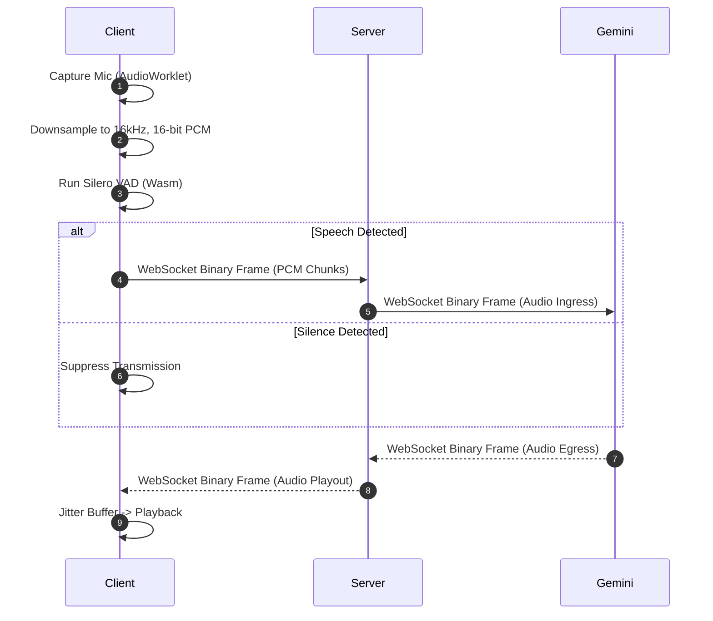
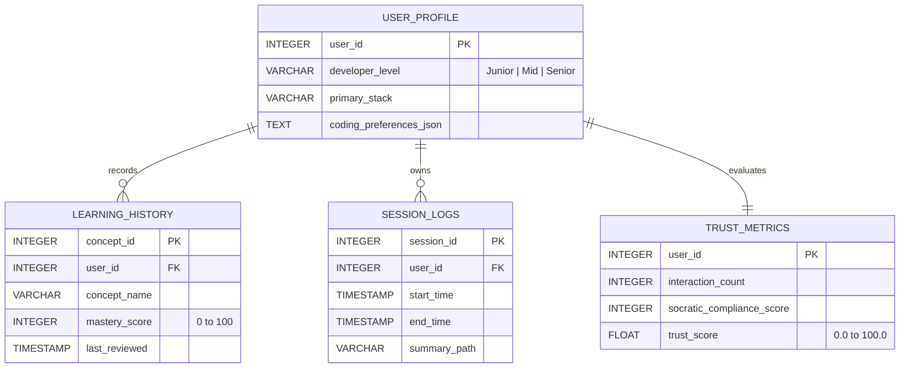

# Taksh v0.1 MVP Specification
*(Engineering Implementation Blueprint for a Voice-Enabled Socratic Engineering Mentor)*

> [!NOTE]
> This document translates the [PRD v0.1](file:///d:/Taksh/Architecture/prd_v0.1.md) and [System Architecture](file:///d:/Taksh/Architecture/system_architecture.md) into concrete, actionable engineering specifications for the v0.1 MVP release. It defines the schemas, protocols, APIs, UI layout, and testing matrices required to build and validate the prototype.

---

## 1. Scope & MVP Boundaries

The core objective of Taksh v0.1 is to validate a low-latency, voice-first Socratic feedback loop coupled with localized memory and context RAG. 

```
  ┌──────────────────────────────────────────────────────────────────┐
  │                        Taksh v0.1 Scope                          │
  ├──────────────────────┬───────────────────────────────────────────┤
  │       IN SCOPE       │          OUT OF SCOPE [Future Planned]    │
  ├──────────────────────┼───────────────────────────────────────────┤
  │ • Browser React App  │ • Native IDE Plugins                      │
  │ • Local FastAPI WS   │ • Auto File Writing                       │
  │ • Silero Web VAD     │ • Local Audio LLMs                        │
  │ • SQLite DB Memory   │ • Multi-Agent Systems [Planned | Not v0.1]│
  │ • ChromaDB Local RAG │ • Visual Memory [Planned | Not v0.1]      │
  │                      │ • Emotion Analysis [Planned | Not v0.1]   │
  │                      │ • Webcam Context [Planned | Not v0.1]     │
  └──────────────────────┴───────────────────────────────────────────┘
```

### 1.1. In-Scope Focus Areas
*   **Web Dashboard UI**: A lightweight, split-screen adaptable React web app to control the audio stream and monitor project context.
*   **Bidirectional Voice Gateway**: Streaming raw $16\text{kHz}$ PCM microphone audio over local WebSockets to FastAPI, proxied directly to the Gemini Multimodal Live API.
*   **Local Sidecar Memory**: File-system-based cache directories (`.taksh/`) storing relational history (SQLite), vector chunks (ChromaDB), and session markdown logs.
*   **Workspace Watcher**: Filesystem watchdog tracing active file modifications, cursor selections, and build error logs.
*   **Socratic Prompt Engine**: Logical state toggle enforcing conceptual pseudocode output over direct code injection.

---

## 2. Component Workflows & Data Flows

### 2.1. Dual-Channel Ingestion & Voice Loop
The audio pipeline must achieve sub-second processing speeds. The client processes audio locally, detects speech boundaries via Web Assembly (Wasm), and pipes audio packets to the server.



### 2.2. Interruption Lifecycle
A vital usability requirement is immediate responsiveness when the user speaks over an active assistant response:
1.  **VAD Trigger**: The client-side VAD engine detects speech onset during audio playout.
2.  **Mute & Flush**: The client-side `AudioPlaybackEngine` instantly silences the current playout node, clears the jitter buffer queue, and changes the UI state to *Listening*.
3.  **JSON Signal**: The client sends a `{"type": "interrupt"}` JSON message over the control websocket.
4.  **Backend Reset**: The FastAPI server interceptor transmits a cancellation signal to the Gemini Multimodal Live session and marks the active database turn record as `interrupted = True`.

---

## 3. Database Schema & Filesystem Layout

### 3.1. Local Filesystem Layout (`.taksh/`)
All application data is encapsulated locally inside a `.taksh/` folder at the root of the active workspace repository.

```
.taksh/
├── taksh.db                 # SQLite relational database
├── chroma/                  # ChromaDB vector database index files
│   └── chroma.sqlite3
├── identity/
│   └── core_identity.md     # Read-only markdown defining prompt rules
├── memory/
│   ├── project_memory.md    # Local project rules and exclusions
│   └── session_history/     # Transcripts and summary logs
│       ├── 0001_session.md
│       └── 0002_session.md
└── knowledge/
    └── manifest.json        # Manifest of ingested files & hashes
```

### 3.2. SQLite Relational Database Schema (`taksh.db`)
The schema tracks developer metrics, trust profiles, and historical sessions.



#### SQLAlchemy Models
```python
from datetime import datetime
from sqlalchemy import Column, Integer, String, Float, DateTime, ForeignKey, Text
from sqlalchemy.orm import declarative_base

Base = declarative_base()

class UserProfile(Base):
    __tablename__ = "user_profile"
    user_id = Column(Integer, primary_key=True, autoincrement=True)
    developer_level = Column(String(50), default="Mid")
    primary_stack = Column(String(100), nullable=False)
    coding_preferences_json = Column(Text, default="{}")

class LearningHistory(Base):
    __tablename__ = "learning_history"
    concept_id = Column(Integer, primary_key=True, autoincrement=True)
    user_id = Column(Integer, ForeignKey("user_profile.user_id"))
    concept_name = Column(String(200), nullable=False)
    mastery_score = Column(Integer, default=0)
    last_reviewed = Column(DateTime, default=datetime.utcnow)

class SessionLogs(Base):
    __tablename__ = "session_logs"
    session_id = Column(Integer, primary_key=True, autoincrement=True)
    user_id = Column(Integer, ForeignKey("user_profile.user_id"))
    start_time = Column(DateTime, default=datetime.utcnow)
    end_time = Column(DateTime, nullable=True)
    summary_path = Column(String(500), nullable=True)

class TrustMetrics(Base):
    __tablename__ = "trust_metrics"
    user_id = Column(Integer, ForeignKey("user_profile.user_id"), primary_key=True)
    interaction_count = Column(Integer, default=0)
    socratic_compliance_score = Column(Integer, default=0)
    trust_score = Column(Float, default=50.0)
```

---

## 4. API & Event Protocol Specifications

### 4.1. WebSocket Endpoint (`ws://localhost:8000/api/v1/voice/stream`)
Handles multiplexed bidirectional audio and JSON control state communications.

#### Client-to-Server Frames
1.  **Binary Frames**: Downsampled raw PCM audio ($16\text{kHz}$ mono, 16-bit, 1024-sample chunks).
2.  **Telemetry JSON Frame**: Sent at $1\text{Hz}$ rate or on active file changes.
    ```json
    {
      "type": "telemetry",
      "timestamp": "2026-06-20T09:18:00Z",
      "payload": {
        "active_file": "src/freertos_tasks.c",
        "cursor_line": 142,
        "selection": "void vTaskDelay(const TickType_t xTicksToDelay)",
        "compiler_error": "conflicting types for 'vTaskDelay'"
      }
    }
    ```
3.  **Control JSON Frame**: Sent instantly when the client interrupts playback.
    ```json
    {
      "type": "interrupt",
      "timestamp": "2026-06-20T09:18:05Z"
    }
    ```

#### Server-to-Client Frames
1.  **Binary Frames**: Assistant voice audio output ($24\text{kHz}$ mono, 16-bit PCM chunks).
2.  **Transcript JSON Frame**: Live tokens for screen rendering.
    ```json
    {
      "type": "transcript",
      "payload": {
        "text": "It seems you have redefined the parameters of vTaskDelay.",
        "is_final": false,
        "role": "assistant"
      }
    }
    ```
3.  **State JSON Frame**: Controls client state displays.
    ```json
    {
      "type": "state",
      "payload": {
        "status": "speaking",
        "active_skills": ["Embedded Systems Architect"]
      }
    }
    ```

---

## 5. UI/UX Layout Specification

The v0.1 UI is built as a responsive single-page dashboard. The layout is optimized to sit side-by-side with code editors.

```
┌────────────────────────────────────────────────────────┐
│  Taksh v0.1 Dashboard                      [Socratic]  │
├───────────────────────────┬────────────────────────────┤
│                           │ Active File:               │
│  [Status: Speaking]       │ src/freertos_tasks.c       │
│  [Voice Channel: Active]  ├────────────────────────────┤
│                           │ Active Skills:             │
│  Transcript:              │ • Embedded Systems         │
│                           │   Architect                │
│  User: How do I delay?    ├────────────────────────────┤
│                           │ Workspace Memory Rules:    │
│  Taksh: Look at the       │ • No blocking delays       │
│  declaration of...        │   in ISR callbacks.        │
│                           │ • Limit stack size to 256. │
│                           ├────────────────────────────┤
│  [Mute] [Disconnect]      │ [Trigger Workspace Index]  │
└───────────────────────────┴────────────────────────────┘
```

### 5.1. Dashboard Layout Structure
*   **Left Column (Interaction Panel)**:
    *   State Indicator Widget (Muted, Listening, Thinking, Speaking, Idle).
    *   Scroll-locked Transcript Window displaying user/assistant text in contrasting bubbles.
    *   Footer Controls: Session Connect/Disconnect button, microphone mute/unmute toggle.
*   **Right Column (Context Monitor)**:
    *   Active File & Telemetry box showing what Taksh currently sees.
    *   Skills List showing active overlays based on workspace files.
    *   Project Memory Viewer displaying the contents of `project_memory.md`.
    *   Workspace Control: A manual trigger button for rebuilding the RAG index database.

### 5.2. Styling Guidelines (Vanilla CSS)
*   Define a semantic color system with dark mode priorities:
    ```css
    :root {
      --bg-primary: #0F172A;     /* Deep slate background */
      --bg-secondary: #1E293B;   /* Card surfaces */
      --accent-primary: #6366F1; /* Indigo brand accents */
      --accent-hover: #4F46E5;
      --text-main: #F8FAFC;      /* High contrast text */
      --text-muted: #94A3B8;     /* Inactive elements */
      --state-green: #10B981;    /* Active/Connected */
      --state-amber: #F59E0B;    /* Processing/Thinking */
    }
    ```
*   Use standard layout grids (`display: grid`) and flexible containers (`display: flex`) to avoid layout breaks during resize down to a minimum width of $360\text{px}$.

---

## 6. Prompt Composition & Skills Engine

### 6.1. Dynamic System Instructions Assembly
Before opening a new connection, the session manager generates a unified system instruction payload. It aggregates state from multiple systems.

```
┌────────────────────────────────────────────────────────┐
│               Dynamic System Instruction               │
├────────────────────────────────────────────────────────┤
│ 1. Core Identity (.taksh/identity/core_identity.md)    │
├────────────────────────────────────────────────────────┤
│ 2. Socratic Guidelines (If Socratic mode is active)     │
├────────────────────────────────────────────────────────┤
│ 3. Active Skills Overlays (ESP32, FreeRTOS, etc.)      │
├────────────────────────────────────────────────────────┤
│ 4. User Profile & Mastery (Relational SQLite logs)     │
├────────────────────────────────────────────────────────┤
│ 5. Workspace Path Rules (.taksh/memory/project_memory) │
├────────────────────────────────────────────────────────┤
│ 6. Injected RAG Documentation Chunks (top-k search)    │
└────────────────────────────────────────────────────────┘
```

### 6.2. Composition Rules
1.  **Immutable Baseline**: The `core_identity.md` parameters are loaded as raw string prefixes. They cannot be modified or replaced.
2.  **Skill Triggering Logic**:
    *   *Workspace File Detection*: The file-system watcher parses file suffixes and imports. Finding imports containing `freertos/` automatically appends the `Embedded Systems Architect` instruction overlay.
    *   *Semantic Keyword Matching*: If the user mentions a specific database tool or framework, the related domain-centric skills package (e.g. `Full-Stack Software Architect`) is activated for the session context.
3.  **Strict Size Boundary**: The combined text of the dynamic system instruction must be managed to fit within token boundaries to prevent latency degradation. The system limits retrieved RAG chunks to the top 3 (max $2000$ tokens total).

---

## 7. Verification & Testing Matrix

The following verification steps must be completed to sign off on the v0.1 MVP release:

| Test ID | Area | Scenario | Steps to Execute | Target Success Criteria |
| :--- | :--- | :--- | :--- | :--- |
| **TS-01** | Voice | Latency Ingress | 1. Open voice channel.<br/>2. Speak a 10-word sentence.<br/>3. Measure delay to assistant response. | Response audio output starts in $\le 1.2$ seconds (p50). |
| **TS-02** | Voice | Playback Interruption | 1. Ask assistant a broad question.<br/>2. During assistant reply, speak over it.<br/>3. Verify audio termination. | Assistant playback silences immediately; client flushes the buffer. |
| **TS-03** | Memory | Database Logging | 1. Connect, discuss a topic, disconnect.<br/>2. Query `session_logs` table in `taksh.db`. | Row exists with accurate timestamps; a markdown session log is generated. |
| **TS-04** | Memory | Constraints Enforcement | 1. Write a blocking delay in workspace code.<br/>2. Ask "Review my code." | Agent flags the delay pattern based on `.taksh/memory/project_memory.md` rules. |
| **TS-05** | RAG | Documentation RAG | 1. Add custom documentation `.md` file to workspace.<br/>2. Trigger ingest.<br/>3. Query the topic. | Search correctly retrieves documentation chunks and injects them into system instructions. |
| **TS-06** | Skills | Dynamic Activation | 1. Open a `.py` file containing `from django.db import models`. | The "Full-Stack Software Architect" skill status shows as active on the dashboard. |
| **TS-07** | Pedagogy | Socratic Constraint | 1. Toggle Socratic mode ON.<br/>2. Ask: "Write a bubble sort function." | Assistant describes bubble sort conceptually; does not return code blocks. |
