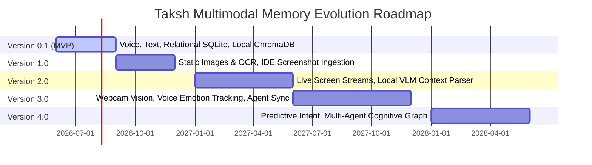
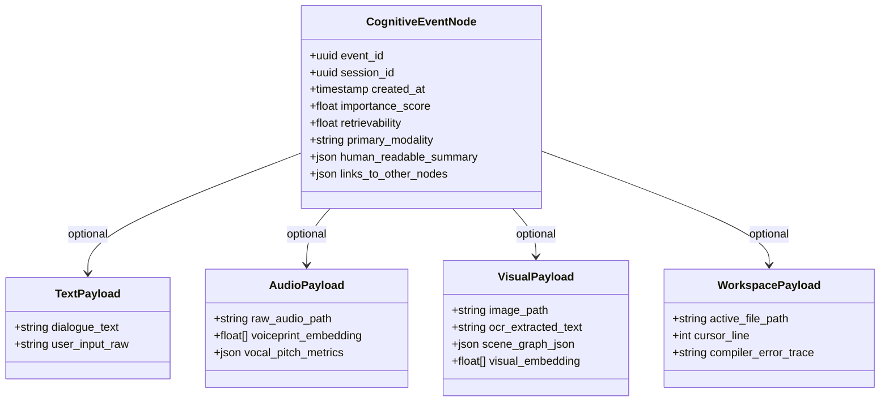
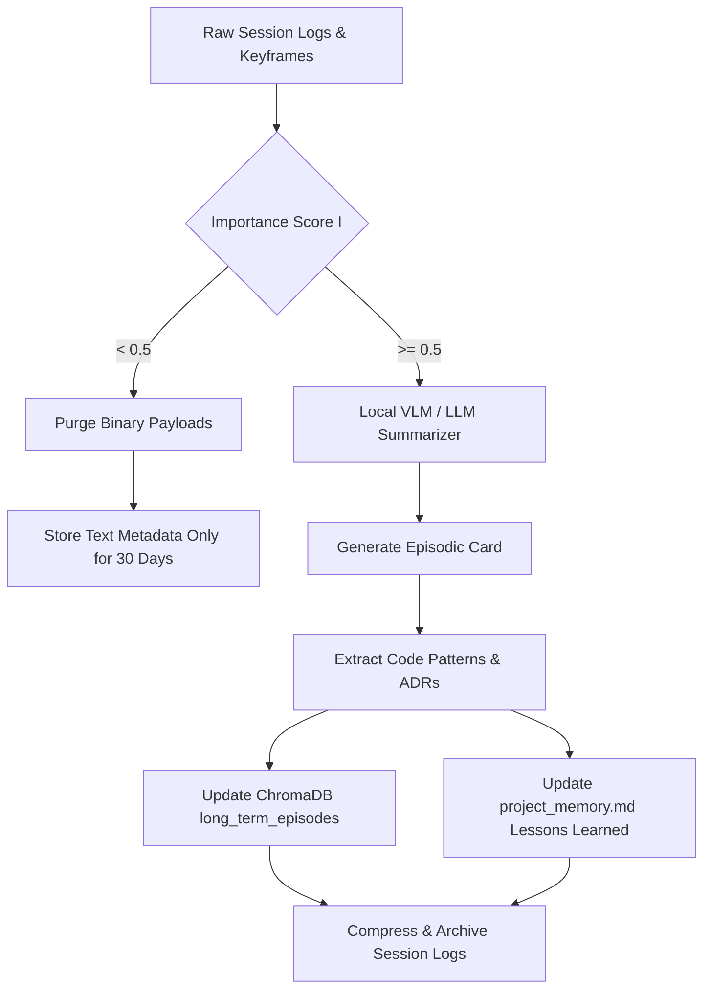

# Multimodal Memory Systems Architecture — Taksh (v0.1 – v4.0)
**Unified Cognitive State Graph, Multimodal Ingestion Engine, and Temporal Consolidation Strategy**

> [!NOTE]
> This document specifies the complete, forward-compatible memory architecture for Taksh as it evolves from a local voice sidecar (v0.1) into a multimodal, live-observation engineering companion (v4.0). This architecture employs a **Unified Multimodal Event Graph** to ensure backward compatibility and prevent structural rewrite cycles.

---

## 1. Architectural Evolution Roadmap (v0.1 – v4.0)

To support future multimodal extensions without requiring a database redesign, the system uses a **Unified Multimodal Event Schema** from v0.1. Newer modalities map into this schema as metadata extensions and auxiliary binary pointers.

> [!NOTE]
> All future capabilities including **Visual Memory**, **Emotion Analysis**, **Webcam Context**, and **Multi-Agent Systems** are explicitly marked as **Planned | Not implemented in v0.1**.



### Modality & Storage Evolution Matrix

| Version | Primary Input Modalities | Primary Storage Backend | Vector Embedding Strategy | Visual Memory Model |
| :--- | :--- | :--- | :--- | :--- |
| **v0.1** | Voice (PCM), Text (Markdown) | SQLite + ChromaDB (Local) | `all-MiniLM-L6-v2` (Text only) | *None* |
| **v1.0** | Voice, Text, Static Images, OCR | SQLite + ChromaDB + Local Disk | `all-MiniLM-L6-v2` + Tesseract OCR text | Image metadata + local text summaries of visual logs |
| **v2.0** | Voice, Text, Images, Live Screen (1fps) | SQLite + ChromaDB + Local Frame Cache | Joint text/image embeddings (e.g., `CLIP` / `ImageBind`) | VLM-generated visual scene graphs & keyframe logging |
| **v3.0** | Voice, Text, Images, Live Screen, Webcam | SQLite + ChromaDB + Local Frame Cache | Multi-vector collections + Dynamic Graph DB | Live webcam facial expressions & environmental context |
| **v4.0** | Full Multimodal Streaming (Continuous) | Distributed SQLite + Local Vector + Graph DB | Unified Multimodal Embedding Space | Continuous real-time visual-spatial state prediction |

---

## 2. Unified Multimodal Event Schema

All inputs are stored as **Cognitive Event Nodes** in a unified schema. This allows text, audio logs, screen buffers, and webcam feeds to be linked to a single interaction session.



### Relational Schema (SQLite Implementation)

```sql
CREATE TABLE cognitive_events (
    event_id TEXT PRIMARY KEY,
    session_id TEXT NOT NULL,
    created_at TIMESTAMP DEFAULT CURRENT_TIMESTAMP,
    importance_score REAL DEFAULT 0.0,
    retrievability REAL DEFAULT 1.0,
    primary_modality TEXT NOT NULL, -- 'text', 'voice', 'image', 'multimodal'
    summary TEXT, -- LLM-synthesized textual summary of the event
    FOREIGN KEY(session_id) REFERENCES sessions(session_id)
);

CREATE TABLE event_payloads_text (
    event_id TEXT PRIMARY KEY,
    transcript TEXT,
    system_prompt_injected TEXT,
    FOREIGN KEY(event_id) REFERENCES cognitive_events(event_id)
);

CREATE TABLE event_payloads_audio (
    event_id TEXT PRIMARY KEY,
    audio_file_path TEXT,
    vocal_tension REAL, -- Indicator of user frustration
    voiceprint_hash TEXT,
    FOREIGN KEY(event_id) REFERENCES cognitive_events(event_id)
);

CREATE TABLE event_payloads_visual (
    event_id TEXT PRIMARY KEY,
    frame_path TEXT, -- Pointer to compressed disk-stored keyframe
    ocr_content TEXT, -- Extracted text from screenshot / terminal
    scene_description TEXT, -- Local VLM description
    visual_hash TEXT, -- To prevent duplicate frame storage
    FOREIGN KEY(event_id) REFERENCES cognitive_events(event_id)
);

CREATE TABLE event_payloads_workspace (
    event_id TEXT PRIMARY KEY,
    active_file TEXT,
    cursor_line INTEGER,
    selected_code TEXT,
    terminal_stderr TEXT,
    FOREIGN KEY(event_id) REFERENCES cognitive_events(event_id)
);
```

---

## 3. Memory Subsystems (1 to 7)

```
┌────────────────────────────────────────────────────────────────────────────────────────┐
│                                   COGNITIVE ORCHESTRATOR                               │
└────────────────────────────────────────────────────────────────────────────────────────┘
          ▲                      ▲                      ▲                       ▲
          ▼                      ▼                      ▼                       ▼
┌───────────────────┐  ┌───────────────────┐  ┌───────────────────┐   ┌──────────────────┐
│ 1. IDENTITY MEM   │  │ 2. SESSION MEM    │  │ 3. WORKING MEM    │   │ 4. PROJECT MEM   │
│ Invariant values, │  │ Raw input streams │  │ task.md, dynamic  │   │ project_memory,  │
│ safety filters    │  │ (audio, frames)   │  │ conversational thread│ ADR vector rules  │
└───────────────────┘  └───────────────────┘  └───────────────────┘   └──────────────────┘
          ▲                      ▲                      ▲                       ▲
          ▼                      ▼                      ▼                       ▼
┌───────────────────┐  ┌───────────────────┐  ┌───────────────────┐   ┌──────────────────┐
│ 5. LONG-TERM MEM  │  │ 6. KNOWLEDGE MEM  │  │ 7. VISUAL MEM     │   │                  │
│ SQLite stats,     │  │ Local/ext docs,   │  │ Scene graphs, OCR │   │                  │
│ episodic ChromaDB │  │ schemas, specs    │  │ screen buffers    │   │                  │
└───────────────────┘  └───────────────────┘  └───────────────────┘   └──────────────────┘
```

### 1. Identity Memory (Pedagogical Baseline)
*   **Purpose**: Preserves Taksh's persona, instructional values, Socratic boundaries, and safety policies.
*   **Implementation**: Stored in a read-only Markdown file `.taksh/identity/core_identity.md`.
*   **Lifecycle**: Loaded once at startup into an immutable Singleton (`CoreIdentityManager`). It is injected directly into the Gemini session initialization config.

### 2. Session Memory (Volatile Stream Ingestion)
*   **Purpose**: Manages real-time raw streams.
*   **Data Structures**:
    *   **Audio Queue**: Ring buffer holding the last 10 seconds of raw 16kHz PCM audio.
    *   **Visual Frame Cache**: Ring buffer holding the last 5 captured screenshots (compressed JPEG, 1fps).
    *   **Telemetry Frame**: Live register of cursor lines, open buffers, and terminal logs.
*   **Lifecycle**: Cleared completely upon disconnect or session teardown.

### 3. Working Memory (Short-Term Conversational State)
*   **Purpose**: Maintains active reasoning context.
*   **Implementation**:
    *   **dialogue_thread**: Structured list of the last 20 multimodal interactions.
    *   **active_plan**: Loaded from `task.md` in the workspace root.
*   **Lifecycle**: Synced continuously with the workspace files and serialized to disk upon session teardown.

### 4. Project Memory (Local Repository Rules)
*   **Purpose**: Tracks workspace-specific architecture guidelines, allowed frameworks, and build targets.
*   **Implementation**: Parsed from `.taksh/memory/project_memory.md` at startup. Written to by the **Consolidation Engine** during nightly runs.

### 5. Long-Term Memory (Episodic & Global Semantic)
*   **Purpose**: Retains insights across coding sessions and projects.
*   **Implementation**:
    *   **SQLite Tables**: Developer profile history, concept mastery index, and trust calculation scores.
    *   **ChromaDB Collection (`long_term_episodes`)**: Vectorized semantic representations of resolved issues and architectural debates.

### 6. Knowledge Memory (Dynamic Grounding)
*   **Purpose**: Stores documentation vectors, library specs, APIs, and circuit schemas.
*   **Implementation**: Hybrid index (ChromaDB + BM25 keyword index) containing workspace markdowns and cached web pages.

### 7. Visual Memory [Planned | Not implemented in v0.1]
*   **Status**: Planned | Not implemented in v0.1
*   **Purpose**: Tracks what the user sees on their workspace screen and environment.
*   **Implementation (v1.0 – v2.0+)**:
    *   **IDE Screenshot Parser**: Extracts text via OCR (Tesseract/VLM) to verify errors.
    *   **VLM Scene Generator**: Local Vision-Language Model processes screenshots and generates textual representations of window arrangements and visual bugs.
    *   **Unified Multi-Vector Index**: Stored in ChromaDB under the `visual_keyframes` collection, pairing visual feature embeddings (CLIP/ImageBind) with text descriptions.

---

## 8. Memory Consolidation Pipeline

To prevent database bloat and ensure that raw screenshots, audio segments, and telemetry do not overflow storage, a cron-driven **Memory Consolidation Engine** runs locally during idle hours.



### Consolidation Steps

1.  **Deduplication of Visual Keyframes**: Screen observation buffers are reviewed. Frames with matching layout hashes (computed via image perceptual hashing, e.g., `pHash`) are deleted, keeping only the frames where UI updates or state changes occurred.
2.  **Episodic Synthesis**: The raw text, audio transcriptions, and OCR data from sessions are sent to a local LLM to generate an episodic card:
    ```markdown
    ### Consolidated Episode: [UUID]
    *   **Context**: Developer was debugging an ESP32 SPI transfer issue.
    *   **Observations**: Screenshot captured a logic analyzer window showing float signals on the MOSI line.
    *   **Resolution**: Discovered missing pull-down resistors on the board layout.
    ```
3.  **Vectorization**: The episodic card is stored in ChromaDB, and the raw audio files and screenshots are deleted from disk to save space.

---

## 9. Memory Importance Scoring

The system uses an Importance Scoring Model to evaluate whether an interaction contains valuable insights that should be elevated to long-term memory.

### Importance Formula

\[
I = w_U \cdot U + w_E \cdot E + w_C \cdot C + w_A \cdot A + w_V \cdot V
\]

Where:
*   $U$: User Explicitness (explicit requests to remember data, range $[0.0, 1.0]$)
*   $E$: Emotional / Frustration Index (voice volume, pitch shifts, error repetition, range $[0.0, 1.0]$)
*   $C$: Cognitive Resolution (whether compiler errors were solved, range $[0.0, 1.0]$)
*   $A$: Architectural Weight (involvement of configurations, schemas, API files, range $[0.0, 1.0]$)
*   $V$: Visual Salience (detection of visual elements like schematics or UI layout bugs, range $[0.0, 1.0]$)

### Weight Configurations by Version

| Modality Config | $w_U$ (User) | $w_E$ (Emotional) | $w_C$ (Cognitive) | $w_A$ (Architecture) | $w_V$ (Visual) |
| :--- | :--- | :--- | :--- | :--- | :--- |
| **v0.1 (Voice/Text)** | 0.45 | 0.15 | 0.25 | 0.15 | 0.00 |
| **v1.0 - v2.0 (OCR/Frames)** | 0.40 | 0.10 | 0.20 | 0.15 | 0.15 |
| **v3.0 - v4.0 (Live Screen/Webcam)** | 0.30 | 0.15 | 0.15 | 0.15 | 0.25 |

### Parameter Descriptions

*   **User Explicitness ($U$)**: Set to $1.0$ if the user says *"remember that..."* or edits `.taksh/memory/project_memory.md`.
*   **Emotional Index ($E$)**: Calculated from vocal pitch variance (v0.1+) and webcam micro-expressions (v3.0+). *Note: Detailed emotion analysis and webcam micro-expression checks are [Planned | Not implemented in v0.1].*
*   **Cognitive Resolution ($C$)**: Scored based on whether active errors in the compiler telemetry are resolved.
*   **Architectural Weight ($A$)**: Checked by AST diff parsing of workspace changes.
*   **Visual Salience ($V$)**: Triggered when a local VLM detects CAD designs, PCB traces, or external diagnostic tool windows (e.g., Logic Analyzers, Oscilloscopes).

---

## 10. Memory Retrieval Pipeline

Retrieval is handled via a multi-query broker that combines semantic, keyword, and visual embeddings.

```
                  [ User Conversational Query / Visual State ]
                                      │
                                      ▼
                        ┌───────────────────────────┐
                        │    Query Reformulation    │ 
                        └─────────────┬─────────────┘
                                      │
         ┌────────────────────────────┼───────────────────────────┐
         ▼                            ▼                           ▼
  ┌─────────────┐              ┌─────────────┐             ┌─────────────┐
  │  Semantic   │              │  Syntactic  │             │   Visual    │
  │ Vector (384)│              │ BM25 Lookup │             │ CLIP Search │
  │  ChromaDB   │              │ SQLite FTS5 │             │  ChromaDB   │
  └──────┬──────┘              └──────┬──────┘             └──────┬──────┘
         │                            │                           │
         └────────────────────────────┼───────────────────────────┘
                                      │
                                      ▼
                        ┌───────────────────────────┐
                        │    Metadata Filtering     │ ◄─── Filter by active domain / board
                        └─────────────┬─────────────┘
                                      │
                                      ▼
                        ┌───────────────────────────┐
                        │   Cross-Encoder Rerank    │ ◄─── Top-K retrieval selection
                        └─────────────┬─────────────┘
                                      │
                                      ▼
                           [ Injected LLM Context ]
```

### Retrieval Phase Specifications
1.  **Multi-Query Formulation**: A local LLM reformulates the user input and the visual state into search queries. For example, if a user points to a screenshot and asks "What is this connector?", the system generates:
    *   *Text Query*: "standard 4-pin board connectors pinouts"
    *   *Visual Embedding Query*: Feature representation of the cropped screenshot region.
2.  **Metadata Constraints**: Restricts the search space to relevant domains (e.g., checking only `01_electronics` database files when looking at a circuit board design).
3.  **Context Assembly**: Integrates the retrieved text, visual logs, and project memory constraints before sending them to the Gemini Multimodal Live API.

---

## 11. Memory Privacy Model

To protect intellectual property and private developer information, Taksh uses a local-first security architecture.

```
[ Developer Workstation - Secure Local Boundary ]
┌──────────────────────────────────────────────┐
│  Source Code / CAD Files / Logic Analyzers   │
│                      │                       │
│                      ▼                       │
│    ┌────────────────────────────────────┐    │
│    │    Optical & Audio Redactor        │    │
│    │  - PII Masking                     │    │
│    │  - Pixelation of password fields   │    │
│    │  - Audio strip of local noise      │    │
│    └─────────────────┬──────────────────┘    │
│                      │                       │
│                      ▼                       │
│     ┌──────────────────────────────────┐     │
│     │   SQLite & ChromaDB (Encrypted)  │     │
│     └────────────────┬─────────────────┘     │
└──────────────────────┼───────────────────────┘
                       │
                       ▼ (Encrypted WebSocket Tunnel)
             [ Gemini Multimodal API ]
```

### Data Redaction and Protection Protocols

1.  **Optical Character Masking (Screenshots)**:
    Before screenshots are saved to disk or sent to the cloud, a local OCR parser identifies sensitive structures:
    *   Passwords, API keys, and connection strings are blacked out.
    *   Faces detected in the webcam stream are blurred locally.
2.  **Audio Noise Filtering**:
    Background voices are filtered out, ensuring only the developer's voice is processed.
3.  **Local Encryption**:
    Local database files (`taksh.db` and the ChromaDB collection index) can be encrypted on disk using SQLCipher, using keys stored in the developer's system keychain (macOS Keychain / Windows Credential Manager).
4.  **Local Loopback Enforcement**:
    The FastAPI backend binds exclusively to `127.0.0.1`. Remote network connections to the backend API are blocked by default.

---

## 12. Memory Lifecycle States

Every cognitive entry transitions through five lifecycle states to manage system memory usage and prevent token bloat:

```
[ Volatile Stream ] ──────► [ Working Memory ] ──────► [ Episodic Storage ]
        │                            │                          │
        ▼ (Discarded)                ▼ (Archived to MD)         ▼ (Decay/Pruned)
    [ Purged ]                [ session_history ]          [ Cold Storage ]
                                     │                          │
                                     ▼                          ▼
                                 [ Nightly ]                [ Purged ]
```

1.  **Sensory Capture**: Live streams (PCM audio, screenshots) are held in memory buffers.
2.  **Active Working Context**: Interaction transcripts are linked to the active task (`task.md`).
3.  **Session Archiving**: Sessions are written to local Markdown logs in `.taksh/memory/session_history/`.
4.  **Episodic Consolidation**: Critical sessions ($I \ge 0.5$) are summarized into episode cards, vectorized in ChromaDB, and added to the project memory history.
5.  **Pruning / Deletion**: Inactive memories are moved to cold storage database files when their retrievability falls below $0.2$, and permanently deleted when retrievability falls below $0.05$.
