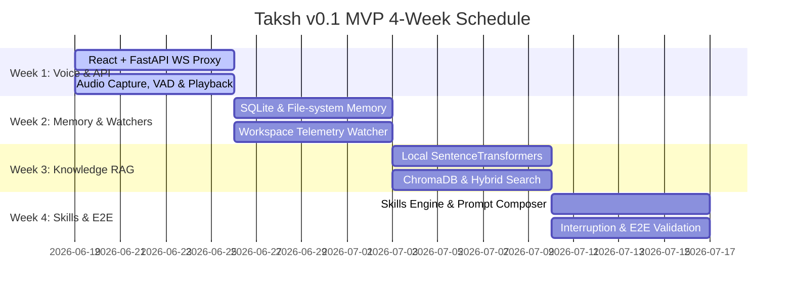

# Taksh v0.1 MVP Implementation Roadmap

This document outlines the **4-week engineering roadmap** to build a working prototype of **Taksh v0.1**, a voice-enabled engineering mentor with memory. The goal of the MVP is to prove the viability of a real-time, low-latency voice feedback loop combined with local repository-level RAG, a 4-tier memory architecture, and a Socratic teaching personality.

---

## Architecture Reference Overview

The roadmap is aligned with the specifications in [system_architecture.md](file:///d:/Taksh/Architecture/system_architecture.md), [prd_v0.1.md](file:///d:/Taksh/Architecture/prd_v0.1.md), and [memory_architecture.md](file:///d:/Taksh/Memory/memory_architecture.md).

---

## Week 1: Core Voice Infrastructure & Backend Proxy

### Focus
Establish the low-latency bidirectional voice loop. Build the FastAPI local proxy server to bridge the browser-based React UI and the Gemini Multimodal Live WebSocket API. Implement raw PCM capture, client-side Voice Activity Detection (VAD), and raw PCM audio playback.

### Deliverables
1. **Frontend Scaffolding**: React + Vite SPA boilerplate configured with the styling system (custom CSS variables, typography, and dark mode theme).
2. **FastAPI Gateway**: Running local server with a WebSocket gateway (`ws://localhost:8000/api/v1/voice/stream`) routing connection events.
3. **Gemini Live Proxy**: Dynamic WebSocket tunnel bridging browser audio frames to the Gemini Multimodal Live API.
4. **Client-Side Media Engine**: Audio recorder downsampling to 16kHz, 16-bit, mono PCM and a playout buffer for receiving audio packets.

### Tasks
- [ ] **Frontend Initialization**: Set up the React dashboard layout containing the active transcript panel, status indicators, and control buttons using CSS grid and flexbox.
- [ ] **Mic Ingestion Engine**: Develop a browser Audio Worklet or script processor to capture microphone input, downsampling it on-the-fly to $16\text{kHz}$ 16-bit mono PCM.
- [ ] **Client VAD Integration**: Set up a Web Assembly instance of Silero VAD (or a custom Web Audio API analyzer fallback) to detect voice boundaries, preventing transmission of background static.
- [ ] **Backend WS Gateway**: Write the FastAPI endpoint for WebSocket connections. Configure it to open a secondary outbound secure WebSocket (`wss://`) session to the Gemini Multimodal Live API using `websockets` or `aiohttp`.
- [ ] **Streaming Voice Proxy**: Implement full-duplex forwarding of raw binary audio frames from the client WS to the Gemini API, and streaming of response PCM chunks back to the client.
- [ ] **Audio Playout Queue**: Build a frontend playback manager with a jitter buffer to sequentially decode and play raw PCM chunks without pops or audio stutter.

### Dependencies
- **API Keys**: Access token and endpoints for the Gemini Multimodal Live API.
- **Local Dev Tools**: Python 3.10+, Node.js 18+ installed on the developer workstation.

### Risks & Mitigations
- **Risk**: WebSocket connection overhead and network transit times push audio latency above the $1.2\text{s}$ threshold.
  - *Mitigation*: Stream response chunks from the backend proxy immediately as they arrive; do not wait for complete audio sentences. Disable Nagle's algorithm (`TCP_NODELAY`) on the backend sockets.
- **Risk**: Browser microphone access blocks or fails to downsample correctly across OS variations.
  - *Mitigation*: Implement fallback downsampling in a dedicated Web Worker to avoid blocking the main UI thread.

### Validation Criteria
- **Audio Loopback**: Speaking a sentence into the microphone streams it to the FastAPI backend, gets processed, and triggers a streaming voice response from the Gemini Live API.
- **Latency Check**: The p50 response latency (from silence detection to audio output start) is $\le 1.5$ seconds under standard local network conditions.
- **UI Responsiveness**: The browser UI does not freeze or drop frames during audio capture or playback.

---

## Week 2: Local Memory Layer & Workspace Telemetry

### Focus
Set up the local file system database structure under `.taksh/`. Build the SQLite database schema, parse localized configuration markdown files (`project_memory.md`), and implement the workspace telemetry watchers to capture active files and compiler failures.

### Deliverables
1. **Workspace Folder Setup**: Auto-initialization of `.taksh/` containing database files and cache directories.
2. **SQLite Relational Registry**: Initialized `taksh.db` tracking profiles, learning mastery, and session metadata.
3. **Workspace Watcher**: React module linked to file and error telemetry.
4. **Memory Manager Component**: Backend class managing the lifetime and persistence of Sensory, Working, and Long-Term memory tiers.

### Tasks
- [ ] **SQLite Schema Implementation**: Write SQLAlchemy/SQLModel models for `USER_PROFILE`, `LEARNING_HISTORY`, `SESSION_LOGS`, and `TRUST_METRICS` (ref: [memory_architecture.md](file:///d:/Taksh/Memory/memory_architecture.md#sqlite-relational-database-schema)).
- [ ] **Workspace Watcher Service**: Develop a folder watcher in FastAPI using `watchdog` to track modified files in the local repository workspace.
- [ ] **React Telemetry Sync**: Build a client-side telemetry scheduler that sends current cursor position, active file name, and console build error buffers over the WebSocket at 1Hz.
- [ ] **Project Memory Parser**: Implement a markdown reader/writer for `project_memory.md` and `task.md` to parse system constraints and update active goals.
- [ ] **Post-Session Summarization**: Write an asynchronous parser triggered on WS disconnect that synthesizes the session transcript and writes a markdown summary log to `.taksh/memory/session_history/`.
- [ ] **Immutable Core Identity Lock**: Establish read-only file permissions on `.taksh/identity/core_identity.md` and load it into an immutable singleton `CoreIdentityManager`.

### Dependencies
- **SQLite3 Library**: Standard library integration.
- **Workspace Access**: Workspace directories must have read/write permissions for the FastAPI process.

### Risks & Mitigations
- **Risk**: Reading and parsing files on every telemetry tick causes CPU spikes and slows database operations.
  - *Mitigation*: Cache the parsed `project_memory.md` rules and `core_identity.md` in memory; only reload them when a filesystem modification event is triggered by the workspace watcher.
- **Risk**: IDE terminal outputs contain huge logs, causing packet size bloat.
  - *Mitigation*: Truncate compiler logs to the last 20 lines of call stacks, focusing on error strings.

### Validation Criteria
- **Folder Generation**: Running the application in an empty workspace automatically constructs `.taksh/`, initializes a blank `taksh.db`, and sets up the template `project_memory.md`.
- **Database Logs**: Simulating a user session updates the `SESSION_LOGS` table with conversation turns and generates a markdown log file in `.taksh/memory/session_history/`.
- **Sensory Updates**: Changing the active file or triggering a build error updates the backend `SensoryMemory` state dictionary within 1 second.

---

## Week 3: Knowledge Base RAG & Vector Indexing

### Focus
Integrate the offline vector database to store and retrieve technical documentation, local READMEs, and architectural decision records. Implement semantic chunking and a hybrid retrieval search matching semantic distance and exact keyword IDs.

### Deliverables
1. **Vector Client**: Integrated local ChromaDB client running in-process.
2. **Local Embedding Pipeline**: Backend pipeline using SentenceTransformers (`all-MiniLM-L6-v2`) executing local embeddings.
3. **Markdown Structural Parser**: Ingestion parser splitting files by markdown headers while preserving hierarchy.
4. **Hybrid Search Engine**: Combined search utilizing ChromaDB (vector cosine similarity) and SQLite FTS5 (full-text search).

### Tasks
- [ ] **ChromaDB Integration**: Configure ChromaDB to run in persistent disk mode storing files under `.taksh/chroma/`.
- [ ] **Embedding Cache**: Cache SentenceTransformers weights locally inside the `.taksh/` folder to prevent remote downloads on startup.
- [ ] **Structure-Aware Chunking**: Write a Python document parser that splits markdown files at `h2` and `h3` boundaries, appending parent path headers to each chunk metadata to retain structural context.
- [ ] **FTS5 Setup**: Write the schema and database hooks to mirror workspace markdown files into a SQLite FTS5 virtual table for keyword searches.
- [ ] **Ingestion Pipeline Trigger**: Build the REST API endpoint `POST /api/v1/knowledge/ingest` that runs the indexing pipeline asynchronously in a background thread.
- [ ] **Retrieval Orchestrator**: Write the hybrid query orchestrator which searches ChromaDB and SQLite FTS5, executes reciprocal rank fusion (RRF), and compiles top-k document snippets.

### Dependencies
- **Python Libraries**: `chromadb`, `sentence-transformers`, and `numpy`.
- **SQLite FTS5 Support**: SQLite binary compiled with FTS5 enabled.

### Risks & Mitigations
- **Risk**: ChromaDB and SentenceTransformers have heavy binaries and resource footprints that might slow down dev startup.
  - *Mitigation*: Lazily load embedding models only when the first ingestion or retrieval request is made. Skip raw source code files in the workspace watcher, indexing only `.md` files.
- **Risk**: Poor retrieval relevance due to keyword mismatches on technical API terms (e.g. `xQueueSend`).
  - *Mitigation*: Rely heavily on the SQLite FTS5 exact keyword match fallback to prioritize specific code symbols over broad semantic similarities.

### Validation Criteria
- **Ingestion Execution**: Ingesting a set of documentation files returns a JSON manifest listing processed files, chunk counts, and generation timestamps.
- **Retrieval Performance**: Querying the RAG engine for a specific term (e.g., "FreeRTOS ISR context switches") returns relevant chunks in under 150ms.
- **Offline Integrity**: Disconnecting from the internet during ingestion and querying does not throw errors, proving complete local execution of the RAG pipeline.

---

## Week 4: Skills Engine, Socratic Coach & End-to-End Validation

### Focus
Combine all systems: implement the Skills Engine, prompt overlay compiler, real-time voice interruption handling, and visual dashboard. Complete end-to-end integration testing simulating real-world developer mentoring workflows.

### Deliverables
1. **Skills Engine Module**: Orchestrator executing prompt adjustments based on active context and keyword triggers.
2. **Socratic Mode**: Active pedagogical rules preventing direct code injection and asking guiding questions.
3. **Interruption Controller**: WebSocket handler capable of immediately stopping client audio playout and resetting the Gemini API session.
4. **E2E Dashboard UI**: Completed React dashboard displaying transcripts, memory states, active skills, and real-time status.

### Tasks
- [ ] **Skills Prompt Registry**: Define prompts for the 10 static developer skills (e.g., *ESP32 Firmware Engineer*, *FreeRTOS Expert*, *React Architect*) and save them as configuration schemas.
- [ ] **Context Composer**: Build the orchestrator method that aggregates:
  1. Core Identity (`core_identity.md`)
  2. Active telemetry (`SensoryMemory`)
  3. Relational developer profile (`USER_PROFILE`)
  4. Retrieved document snippets (RAG)
  5. Active skills prompt overlays
  Inject this formatted system prompt into the Gemini WebSocket initialization payload.
- [ ] **Socratic Coaching Toggle**: Add a state controller that swaps the active system prompt with constraints that prevent the model from outputting direct code blocks, forcing it to suggest conceptual pseudocode.
- [ ] **Voice Interruption Handler**:
  - *Frontend*: Stop playback immediately, clear the PCM jitter buffer, and send `{"type": "interrupt"}` JSON message.
  - *Backend*: Intercept the interrupt frame and transmit the session cancel signal to the Gemini Multimodal Live API WebSocket to stop further audio generation.
- [ ] **UI Polish**: Connect dynamic state indicators (*Listening*, *Thinking*, *Speaking*, *Idle*) to the visual widgets. Add a scroll lock to the live transcript.
- [ ] **E2E Simulation Audits**: Run multi-step engineering debug test cases (e.g. diagnosing a FreeRTOS heap depletion stack trace) and record system performance against success metrics.

### Dependencies
- **Integrated Codebase**: Weeks 1, 2, and 3 deliverables must be merged and stable.
- **Testing Script**: Multi-turn scenarios representing developer levels (Junior vs. Senior).

### Risks & Mitigations
- **Risk**: Interruption loop feedback: client microphone picks up output audio, triggering a false VAD interruption.
  - *Mitigation*: Mute client VAD engine during audio playback, or implement basic echo cancellation bounds.
- **Risk**: Gemini Multimodal Live session times out or builds up massive token costs.
  - *Mitigation*: Implement a session timeout manager that automatically closes the WebSocket channel after 5 minutes of inactivity.

### Validation Criteria
- **Socratic Toggle**: With the Socratic toggle active, asking "Write a binary search in C" must result in the agent explaining the algorithm conceptually and asking the user how they would set the boundary indices rather than outputting code.
- **Interruption Responsiveness**: Verbally speaking over the agent halts audio playback instantly, and the system starts listening to the new speech chunk.
- **End-to-End Metrics**: Meets PRD standards: response latency (p50) $\le 1.2$s, interruption success rate $\ge 95\%$, and successful retrieval of project constraints.

---

## Validation Plan & Test Matrix

The following test matrix will be used to verify the working prototype at the end of Week 4:

| Test ID | Area | Scenario | Expected Behavior | Pass/Fail |
| :--- | :--- | :--- | :--- | :--- |
| **VAL-01** | Voice | Bidirectional Voice Stream | Client can speak, FastAPI proxies to Gemini, and Gemini audio response plays back clearly. | |
| **VAL-02** | VAD | Speech Boundary Detection | Backend only receives audio frames when client is speaking. Silence is not transmitted. | |
| **VAL-03** | Interruption | User voice override | Speaking during assistant playback halts client audio and cancels the current Gemini query turn. | |
| **VAL-04** | Memory | Relational Persistence | Opening app retrieves past developer profile, trust levels, and last session log metadata from `taksh.db`. | |
| **VAL-05** | Memory | Project Constraints | Agent warns user when they attempt to use a prohibited pattern listed in `project_memory.md`. | |
| **VAL-06** | RAG | Documentation Lookup | Asking about a specific topic (e.g. FreeRTOS queues) injects correct markdown documentation chunks into the prompt context. | |
| **VAL-07** | Skills | Skill Activation | Opening a C file with `#include "freertos/FreeRTOS.h"` automatically lists "FreeRTOS Expert" as an active skill on the UI dashboard. | |
| **VAL-08** | Pedagogy | Socratic Interaction | Agent guides a debugging session using leading questions and refuses to provide direct copy-paste code. | |
