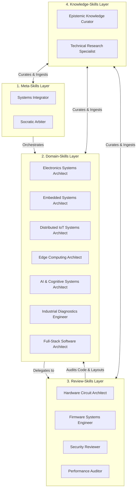
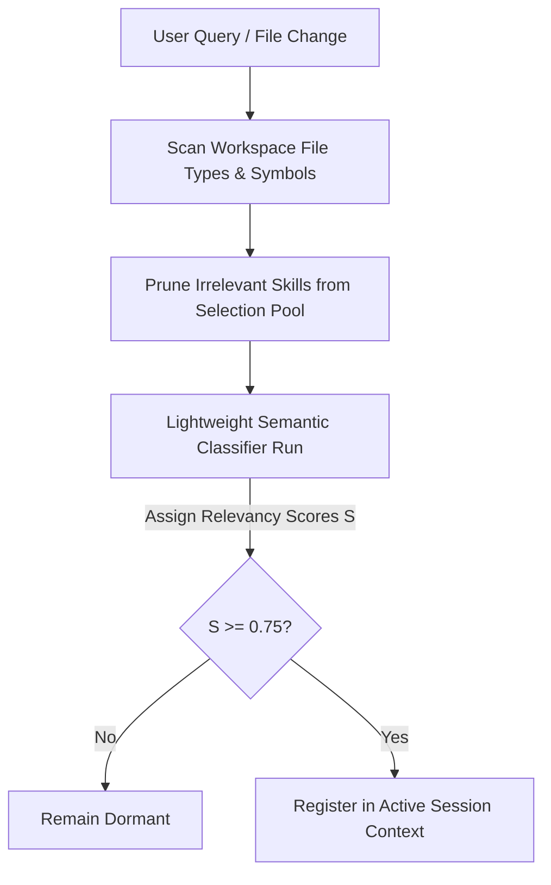
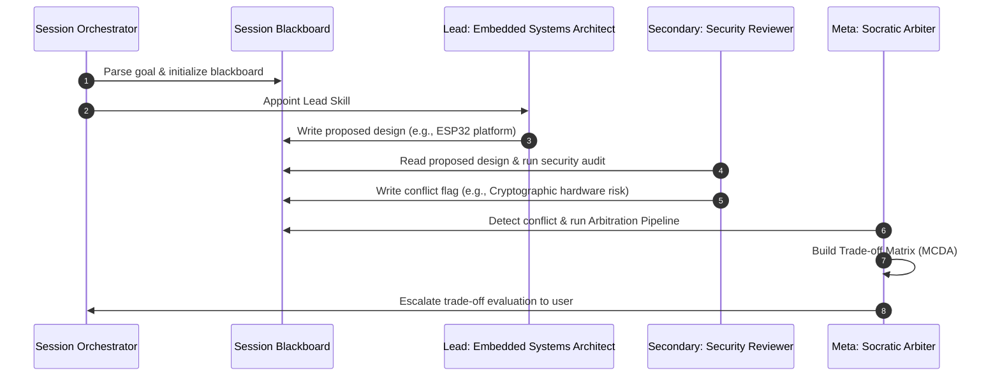

# Taksh Skill Library
*(Epistemic Framework for a Domain-Level, Platform-Agnostic Skills Engine)*

> [!NOTE]
> This document defines the operational specifications, taxonomy, hierarchy, collaboration mechanisms, and activation strategies for the **Taksh Skills Engine**. Designed to remain technology-agnostic and future-proof for the next 10 years, these specifications focus on first principles, physical laws, and architectural standards rather than specific platforms, libraries, or silicon vendors.

---

## 1. Skill Taxonomy & Hierarchy

To separate high-level systems planning, detailed code/layout audits, and cognitive self-evolution, the Skills Engine utilizes a **four-tiered operational hierarchy**:



### Taxonomy Classification
*   **Meta-Skills (Tier 1)**: Core controllers that coordinate multi-skill execution, enforce systems-level integration constraints, and manage Socratic dialogue and conflict resolution.
*   **Domain-Skills (Tier 2)**: Specialized conceptual designers that evaluate architectural requirements, formulate design trade-offs, and make high-level technology recommendations based on physical and mathematical limits.
*   **Review-Skills (Tier 3)**: Execution-level validators that audit code, circuit diagrams, PCB layout geometries, and security configurations against defined industry rules and standards.
*   **Knowledge-Skills (Tier 4)**: Engines responsible for maintaining the local workspace knowledge base, executing background research, and managing cognitive self-evolution.

---

## 2. Skill Activation Strategy

To optimize execution speed, minimize token consumption, and ensure high-quality reasoning without inducing analysis paralysis, Taksh implements a dynamic activation strategy.

### 2.1. Dynamic Gating & Contextual Pruning
A request should not trigger the entire library. The **Orchestrator** prevents over-activation using a two-tier evaluation gate:



1.  **Contextual Pruning**: Before running LLM-based evaluation, the orchestrator checks workspace file types and symbols. For instance, if the workspace contains no PCB schematic or layout files (`.sch`, `.brd`, `.kicad_pcb`), all electronics and PCB skills are immediately pruned from the evaluation pool.
2.  **Semantic Gating**: The orchestrator runs a fast, local semantic classifier against the user request. A skill is loaded only if its relevance score is $S \ge 0.75$.

### 2.2. Task Complexity Estimation
Task complexity is calculated algorithmically using three variables: file scope ($N_{files}$), dependency coupling density ($D_{deps}$), and request linguistic depth ($I_{intent}$):

\[C = w_1 \cdot \log(N_{files} + 1) + w_2 \cdot D_{deps} + w_3 \cdot I_{intent}\]

Where weights are balanced to $w_1 = 1.0$, $w_2 = 1.5$, and $w_3 = 2.0$. The calculated score maps to three categories:

| Complexity Category | Complexity Score ($C$) | Description |
| :--- | :--- | :--- |
| **Simple Task** | $C \le 2.0$ | Conceptual questions, single-file edits, minor documentation lookups. |
| **Medium Task** | $2.0 < C \le 5.0$ | Multi-file changes within one domain layer, localized debugging, API refactors. |
| **Complex Task** | $C > 5.0$ | Cross-domain integration, system refactorings, performance optimization. |

### 2.3. Cost & Token Optimization Model
To prevent prompt bloat, Taksh uses a **Tiered Prompt Ingestion Model**:

*   **Level 1 (Trigger State)**: Only the skill's name and basic trigger rules (100 tokens per skill) are loaded into the orchestrator.
*   **Level 2 (Active State)**: When activated, only the skill's *Core Constraints & Workflows* (approx. 600 tokens) are injected into the system prompt.
*   **Level 3 (Tool-Execution State)**: The detailed rules and reference specs of the skill (up to 3,000 tokens) are loaded *dynamically* and *only* when the agent calls a tool that requires that specific skill's data.

### 2.4. Skill Allocation Limits
To prevent token waste and cognitive loops, active skill counts are strictly capped based on complexity:

| Task Complexity | Max Lead Skills | Max Secondary Skills | Max Total Active Skills |
| :--- | :--- | :--- | :--- |
| **Simple** | 1 | 0 | 1 |
| **Medium** | 1 | 1 | 2 |
| **Complex** | 1 | 3 | 4 |

---

## 3. Multi-Skill Collaboration & Arbitration Workflow

When a task requires multiple domains (e.g., designing an edge signal analyzer with cloud reporting), skills coordinate on a shared Blackboard.



### 3.1. Collaboration Rules
1.  **Blackboard Communication**: Active skills do not converse directly in free-form text. They read from and write to a structured JSON schema on the Blackboard:
    ```json
    {
      "origin_skill": "Firmware Reviewer",
      "target_component": "hal_uart.c",
      "status": "flag | approve",
      "metric_impact": { "latency_ms": 12.0, "ram_bytes": 512 },
      "constraint_violations": ["ISR_BLOCKING_CALL"],
      "recommended_fix": "Replace xQueueSend with xQueueSendFromISR"
    }
    ```
2.  **Strict Turn Limits**: To prevent endless review loops, collaboration turns are hard-capped:
    *   **Medium Tasks**: Max 2 collaboration cycles.
    *   **Complex Tasks**: Max 3 collaboration cycles.
    If a review skill does not raise a new flag within a cycle, it is immediately deactivated.

### 3.2. Conflict Resolution & Arbitration Pipeline
When two skills disagree (e.g., *Embedded Systems Architect* selects a low-cost, low-resource MCU, but *Security Reviewer* flags it for lacking hardware secure boot), the **Socratic Arbiter** executes the following arbitration pipeline:

1.  **Constraint Translation**: Each skill translates its recommendation into quantifiable values:
    *   *Embedded Systems Architect*: Unit Cost = $1.50, Active Power = 120mA, Cryptographic Acceleration = None.
    *   *Security Reviewer*: Secure Boot = Required, Firmware Encryption = Yes, Minimum Crypto Hardware = AES-256.
2.  **Multi-Criteria Decision Analysis (MCDA)**: The Socratic Arbiter evaluates these values against the user's primary project constraints (retrieved from working and long-term project memory).
3.  **Weighted Trade-off Matrix**: The Arbiter calculates a weighted score for both options:
    \[Score = \sum (Weight_i \times Performance_i)\]
4.  **User Escalation**: If the score difference is within a 15% margin, or if it represents an architectural branching point, the Socratic Arbiter halts automated execution, formats the trade-off matrix into a readable UI table, and presents it to the user via voice or text for final confirmation.

---

## 4. Future Expansion & Self-Evolution Strategy

To allow Taksh to learn new engineering domains without requiring code updates to the core engine, the architecture implements **Dynamic Skill Scaffolding**:


1.  **Declarative Manifests**: All skills are defined as declarative markdown manifests located at `Skills/Manifests/skill_name.md`. They contain standardized metadata tags, trigger rules, and input/output interfaces.
2.  **Knowledge-Driven Generation**: When a user introduces a new technology domain (e.g., Quantum Control Circuits), the **Epistemic Knowledge Curator** processes the documentation, extracts the core constraints, generates a new skill manifest, and writes it to the `Skills/Manifests/` directory.
3.  **Dynamic Registration**: The Session Orchestrator scans this directory on startup. Any valid manifest is immediately registered in the active selection pool, enabling zero-code skill evolution.

---

## 5. Tiered Skill Specifications

---

### 5.1. Meta-Skills

#### Systems Integrator
*   **Purpose**: Manages multi-domain integrations, verifies interface compatibility across system boundaries, and enforces project-wide Architectural Decision Records (ADRs).
*   **Inputs**: System interface definitions, API schemas, multi-skill proposals on the Blackboard, active project ADR logs.
*   **Outputs**: Interface compatibility reports, system-level dependency charts, integration fix configurations.
*   **Workflow**:
    1. Scan individual skill proposals for cross-boundary connections (e.g., hardware outputs feeding into edge database schemas).
    2. Check the proposed data formats against interface definitions to identify mismatches.
    3. Audit proposed components against historical project ADRs to ensure architectural compliance.
*   **Success Criteria**: No interface mismatches in final proposed changes; complete compliance with project ADR constraints.

#### Socratic Arbiter
*   **Purpose**: Resolves conflicts between competing skill recommendations, evaluates multi-criteria trade-off matrices, and guides user interaction during architectural decision points.
*   **Inputs**: Conflicting skill recommendations, performance metrics, project design constraints, user-defined priority levels.
*   **Outputs**: Multi-Criteria Decision Analysis (MCDA) matrices, Socratic trade-off questions, final arbitrated architecture proposals.
*   **Workflow**:
    1. Detect conflicting assertions on the Blackboard.
    2. Request quantified constraint metrics from both conflicting skills.
    3. Generate a weighted trade-off matrix evaluating cost, power, latency, complexity, and security.
    4. Compile the trade-offs into Socratic prompts for the user if direct resolution thresholds are not met.
*   **Success Criteria**: Resolves all Blackboard conflicts; escalates decisions to the user with zero jargon, framing trade-offs in quantified engineering metrics.

---

### 5.2. Domain-Skills

#### Electronics Systems Architect
*   **Purpose**: Designs and optimizes analog, digital, and power delivery architectures, focusing on circuit physics, component selection matrices, and signal path topologies.
*   **Inputs**: Electrical requirements, power supply constraints, bandwidth budgets, environmental factors, sensor and actuator datasheets.
*   **Outputs**: Block diagrams, power delivery network (PDN) models, component trade-off evaluations, interface designs.
*   **Workflow**:
    1. Parse system inputs to calculate total maximum and average power consumption.
    2. Evaluate components based on electrical parameters (e.g., input voltage ranges, output current capability, signal-to-noise ratios).
    3. Design circuit protection structures (ESD, overvoltage, reverse polarity).
    4. Structure analog-to-digital signal paths to maximize signal resolution.
*   **Success Criteria**: Power delivery networks meet load demands with $\ge 25\%$ current headroom; analog signal paths optimize signal-to-noise ratio (SNR) based on source impedance.

#### Embedded Systems Architect
*   **Purpose**: Designs bare-metal and RTOS-based system software architectures, optimizing concurrency models, memory-mapped I/O boundaries, and CPU/memory resources.
*   **Inputs**: Hardware specifications, processor architectures (e.g., Harvard vs. Von Neumann, instruction sets), memory constraints, execution timing requirements.
*   **Outputs**: Memory map specifications, task scheduling architectures, peripheral driver APIs, state machine diagrams.
*   **Workflow**:
    1. Analyze memory footprints (Flash, SRAM) to allocate memory regions.
    2. Define concurrency models (event loops vs. preemptive task priority structures).
    3. Design memory-mapped register access layers and DMA channel assignments.
    4. Formulate low-power states based on CPU and peripheral activity profiles.
*   **Success Criteria**: Memory allocations avoid collisions; scheduling designs prevent task starvation and priority inversion.

#### Distributed IoT Systems Architect
*   **Purpose**: Designs secure, resilient edge-to-cloud communication architectures and device-management topologies suited for industrial and distributed environments.
*   **Inputs**: Network conditions, bandwidth budgets, security levels, data schemas, OTA deployment requirements.
*   **Outputs**: Communication protocol recommendations (e.g., Pub-Sub vs. Request-Response), secure provisioning workflows, OTA state machine models, network bandwidth matrices.
*   **Workflow**:
    1. Calculate network payload sizes and evaluate transport protocol efficiency (e.g., overhead comparison of transport protocols).
    2. Design cryptographic handshake processes and certificate rotation strategies.
    3. Establish fail-safe OTA mechanisms with automated rollback policies.
    4. Define state transition patterns for offline data persistence and recovery.
*   **Success Criteria**: Network usage stays within bandwidth allocations; security designs pass TLS 1.3 compliance; OTA rollback mechanisms recover from interrupted transfers.

#### Edge Computing Architect
*   **Purpose**: Optimizes edge data processing, signal filtering, local databases, and execution performance on resource-constrained systems.
*   **Inputs**: Sensor sampling rates, processing budgets, local storage constraints, data filtering requirements.
*   **Outputs**: Filtering pipelines, local database schemas, resource optimization profiles, data aggregation rules.
*   **Workflow**:
    1. Evaluate raw data rates to design aggregation and filtering pipelines.
    2. Select appropriate local storage models (e.g., time-series vs. key-value) based on read/write frequency and flash wear.
    3. Optimize mathematical operations using fixed-point arithmetic where floating-point units are missing or slow.
    4. Profile processing paths to isolate execution bottlenecks.
*   **Success Criteria**: Edge processing executes within local CPU and memory budgets; storage layouts prevent write amplification and excessive flash degradation.

#### AI & Cognitive Systems Architect
*   **Purpose**: Configures cognitive agent architectures, retrieval pipelines (RAG), agent planning loops, and semantic evaluation models.
*   **Inputs**: RAG performance metrics, query logs, system prompt layouts, vector database schemas, agent trace logs.
*   **Outputs**: Semantic chunking models, query routing strategies, prompt architectures, evaluation benchmark datasets.
*   **Workflow**:
    1. Design document parsing and chunking configurations preserving hierarchical context.
    2. Build hybrid search queries combining vector search with keyword indices.
    3. Structure agent planning execution graphs (e.g., state machines, ReAct loops).
    4. Evaluate generated outputs against reference datasets to measure retrieval recall and generation accuracy.
*   **Success Criteria**: Retrieval precision matches or exceeds target thresholds; agent planning loops resolve goals without getting stuck in execution loops.

#### Industrial Diagnostics Engineer
*   **Purpose**: Designs algorithms to model degradation, analyze failure modes, and detect physical asset anomalies from sensor data.
*   **Inputs**: Failure Mode and Effects Analysis (FMEA) sheets, sensor telemetry datasets, physical asset parameters, operating conditions.
*   **Outputs**: Degradation models, feature extraction rules, anomaly detection thresholds, diagnostic classification rules.
*   **Workflow**:
    1. Correlate sensor parameters with known asset failure modes from FMEA documentation.
    2. Define time-domain features (e.g., Root Mean Square, Crest Factor) and frequency-domain features (e.g., spectral energy bands).
    3. Construct anomaly detection models based on statistical deviations (e.g., Mahalanobis distance) or lightweight edge classification rules.
    4. Map anomalies back to specific components (e.g., bearing wear, shaft misalignment).
*   **Success Criteria**: Anomaly detection logic identifies degradation signatures before critical failures; false alarm rates remain below target margins.

#### Full-Stack Software Architect
*   **Purpose**: Designs backend and frontend software architectures, optimizing data persistence layers, API designs, cache topologies, and component layouts.
*   **Inputs**: System requirements, user interaction profiles, API performance metrics, database schemas, scaling targets.
*   **Outputs**: Logical database schemas, API contracts, state management patterns, frontend component structures.
*   **Workflow**:
    1. Structure database schemas using appropriate normalization rules and index configurations.
    2. Design API contracts separating concerns between client and server.
    3. Design state propagation models (atomic stores, context limits) to optimize UI responsiveness.
    4. Implement caching strategies (e.g., write-through, read-through) to minimize database load.
*   **Success Criteria**: Database layouts eliminate redundant queries; API response latency satisfies performance targets; UI states update efficiently without unnecessary re-renders.

---

### 5.3. Review-Skills

#### Hardware Circuit Architect
*   **Purpose**: Audits PCB schematics and layout geometries to ensure signal integrity, power delivery stability, DFM compliance, and electromagnetic compatibility.
*   **Inputs**: Schematic netlists, layout Gerber files, stackup definitions, high-speed trace parameters, fabrication limits.
*   **Outputs**: Layout audit checklists, trace impedance calculations, decoupling proximity reports, EMI risk analyses.
*   **Workflow**:
    1. Verify that decoupling capacitors are placed physically adjacent to target power pins with minimal return loop inductance.
    2. Calculate trace characteristic impedance ($Z_0$) and differential impedance ($Z_{diff}$) to verify matching.
    3. Scan signal reference planes to identify traces crossing splits or discontinuities.
    4. Check layout dimensions against manufacturer fabrication rules (trace spacing, via diameters, annular rings).
*   **Success Criteria**: No floating nets; high-speed trace return paths are continuous; layout dimensions comply with manufacturer manufacturing constraints.

#### Firmware Systems Engineer
*   **Purpose**: Audits embedded code base quality, identifying synchronization errors, memory leaks, interrupt violations, and resource inefficiencies.
*   **Inputs**: Source code files (C/C++), compiler logs, static analysis outputs, link maps, RTOS configurations.
*   **Outputs**: Code review reports, concurrency risk maps, static memory utilization profiles, interrupt performance reviews.
*   **Workflow**:
    1. Analyze code for race conditions, deadlock paths, and priority inversions.
    2. Verify that Interrupt Service Routines (ISRs) utilize non-blocking, ISR-safe API calls and execute quickly.
    3. Inspect dynamic memory allocations to confirm every allocation path matches a deallocation path.
    4. Audit peripheral driver code for proper error handling and watchdog timer integration.
*   **Success Criteria**: Zero potential concurrency deadlocks; zero ISR-related scheduler blocks; dynamic memory operations are leak-free.

#### Security Reviewer
*   **Purpose**: Audits software, networks, and hardware layouts to identify cryptographic weaknesses, storage vulnerabilities, and transport insecurities.
*   **Inputs**: Source code, network configurations, encryption configurations, access logs, system threat models.
*   **Outputs**: Threat modeling reports, encryption evaluations, vulnerability registers, remediation guidelines.
*   **Workflow**:
    1. Audit source code for hardcoded secrets, API tokens, and insecure protocols (e.g., plain HTTP).
    2. Evaluate encryption configurations (TLS versions, cipher suites) and key storage security.
    3. Analyze authentication and authorization paths to ensure strict access control.
    4. Check software dependency trees for known vulnerabilities (CVEs).
*   **Success Criteria**: Zero hardcoded secrets in version control; encryption algorithms match modern standards; third-party dependency vulnerabilities are flagged and mitigated.

#### Performance Auditor
*   **Purpose**: Profiles software and hardware systems to detect execution bottlenecks, memory bloat, network latency, and physical power leaks.
*   **Inputs**: Profiling traces, memory usage reports, execution time logs, network packets, power profile data.
*   **Outputs**: CPU/Memory utilization profiles, execution latency reports, optimization recommendations, resource consumption graphs.
*   **Workflow**:
    1. Identify hot paths in execution traces where the CPU spends significant cycles.
    2. Track heap memory size over time to detect memory bloat or cache build-ups.
    3. Measure network response times and trace payloads to identify transit bottlenecks.
    4. Audit power metrics during hardware active states to locate unnecessary peripheral usage.
*   **Success Criteria**: Critical paths operate within execution time budgets; memory consumption profiles stabilize under load; network communication overhead is minimized.

---

### 5.4. Knowledge-Skills

#### Epistemic Knowledge Curator
*   **Purpose**: Evaluates, structures, and updates the local markdown knowledge files and vector databases, extracting patterns from sessions to drive self-evolution.
*   **Inputs**: Post-session summaries, developer debug transcripts, external documentation pools, active project ADRs.
*   **Outputs**: Structured markdown documentation, updated vector index databases, newly scaffolded skill manifests.
*   **Workflow**:
    1. Evaluate post-session summaries to isolate new design insights and lessons learned.
    2. Update local markdown files (`Knowledge/`) ensuring structural conformance and cross-domain linking.
    3. Re-index modified documents into the ChromaDB vector database.
    4. Identify new domain trends and generate skill manifests (`Skills/Manifests/`) to support system self-evolution.
*   **Success Criteria**: Core documentation files remain up to date; vector database queries return contextually correct chunks; newly generated skill manifests pass validation checks.

#### Technical Research Specialist
*   **Purpose**: Audits external specifications, runs multi-turn search queries, compares third-party libraries, and verifies license compliance.
*   **Inputs**: Research objectives, external URLs, RFC standards, software licenses, search parameters.
*   **Outputs**: Literature review summaries, library comparison matrices, license compatibility evaluations.
*   **Workflow**:
    1. Formulate structured search terms and retrieve relevant documentation, RFCs, or codebases.
    2. Extract key metrics (e.g., license types, package size, security records, update frequency).
    3. Check licenses against target deployment criteria to flag compatibility risks.
    4. Summarize technical documentation into clear engineering reviews with verified citations.
*   **Success Criteria**: Comparison matrices present complete evaluation criteria; licensing reviews identify potential copyleft or commercial integration hazards; citations link directly to verified sources.
