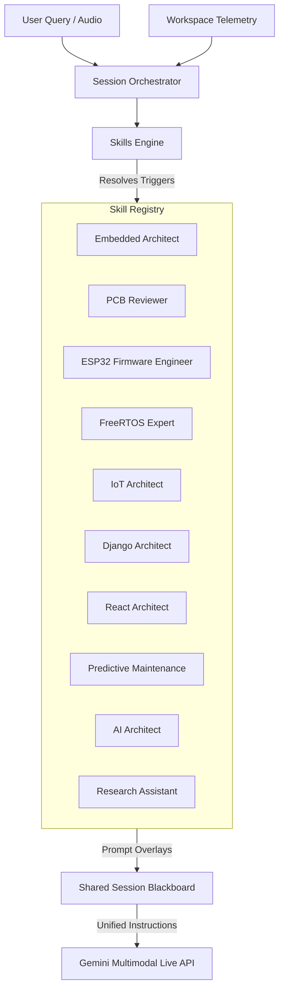

# Taksh Skill Library
*(Operational Specifications for the Dynamic Skills Engine)*

> [!NOTE]
> This document details the specifications of the 10 core AI skills embedded in the **Taksh Skills Engine**. These skills are dynamically loaded by the Session Orchestrator based on workspace triggers, user queries, and sensory memory context. Each specification defines the operational limits, workflows, and success metrics for the agent.

---

## Skill Composition Model

The Skills Engine activates skills based on three parallel pathways:
1. **Static Trigger Evaluation**: Checks open files and workspace symbols (e.g., `#include "freertos/FreeRTOS.h"` triggers the *FreeRTOS Expert*).
2. **Semantic Intent Mapping**: Maps natural language questions (e.g., "What's the best partition layout?") to the relevant skill (e.g., *ESP32 Firmware Engineer*).
3. **Blackboard Pattern Composition**: Combines constraints from multiple active skills (e.g., *IoT Architect* + *ESP32 Firmware Engineer* cooperate when designing low-power secure telemetry on an ESP32).

---

## 1. Embedded Architect

### Purpose
The **Embedded Architect** skill guides the user in designing robust hardware-independent systems, defining memory-mapped peripheral boundaries, formulating power budgets, and establishing solid hardware abstraction layers (HAL). It focuses on the physics of electronic hardware, microarchitectures, and hardware-software co-design.

### Inputs
*   **Workspace Triggers**: System block diagrams, data sheets, timing diagrams, power profiles, memory map files (`.ld`, `.map`), MCU selections.
*   **User Queries**: Core questions regarding bus speeds, DMA mapping, interrupt latency, sleep profiles, peripheral multiplexing, or component selections.
*   **Sensory Context**: Open registers definition files, peripheral configuration schemas (e.g., Pin multiplexing sheets).

### Outputs
*   **Memory Map Allocations**: Relational and absolute boundary mapping for Flash, SRAM, Core-Coupled Memory (CCM), and external storage.
*   **Power Budget Matrices**: Dynamic and static current calculations across operating modes (Run, Sleep, Deep Sleep, Hibernate).
*   **HAL & Peripheral API Designs**: Clean, modular API signatures for bare-metal drivers (I2C, SPI, UART, ADC) separating hardware details from application logic.

### Workflow
1.  **Analyze System Constraints**: Extract system specifications, processor frequency ($f_{CPU}$), memory boundaries, and operating voltage ($V_{DD}$).
2.  **Evaluate Memory Layouts**: Analyze link scripts (`.ld`) to prevent stack-heap collisions and optimize memory utilization (e.g., mapping fast ISR handlers to CCM SRAM).
3.  **Perform Bus & DMA Auditing**: Calculate bus bandwidth and optimize DMA channel allocations to prevent bus contention between high-speed peripherals (e.g., ADC, SPI) and the CPU.
4.  **Formulate Power and Timing Profiles**:
    *   Compute total average current: 
        \[I_{avg} = \frac{\sum (I_i \times t_i)}{T_{period}}\]
    *   Draft low-power transitions and state flow diagrams.

### Success Criteria
*   **Resource Feasibility**: Memory layout structures leave at least a 20% safety margin for stack growth.
*   **Deterministic Timing**: Peripheral communication models prevent CPU starvation and keep interrupt latency below target bounds.
*   **Hardware Isolation**: The HAL layer contains zero direct register writes in application space, utilizing clean, functional boundaries.

---

## 2. PCB Reviewer

### Purpose
The **PCB Reviewer** skill reviews schematics and layout designs to ensure signal integrity (SI), power integrity (PI), thermal performance, manufacturing compliance (DFM/DFA), and electromagnetic compatibility (EMC). It acts as an automated design verification peer.

### Inputs
*   **Workspace Triggers**: Schematic netlists, Gerber files, BOM lists, stackup specifications, high-speed routing rules, component data sheets.
*   **User Queries**: Inquiries regarding decoupling capacitor placements, differential pair impedance matching, thermal via design, or ground plane segmentation.
*   **Sensory Context**: Current PCB layout images or schematic screenshots shared via visual channels.

### Outputs
*   **Review Report**: Line-by-line review of decoupling placements, impedance mismatches, loop-area hazards, and trace spacing issues.
*   **SI/PI Calculations**: High-speed trace characteristic impedance ($Z_0$) and differential impedance ($Z_{diff}$) verification:
    \[Z_0 = \frac{87}{\sqrt{\epsilon_r + 1.41}} \ln\left(\frac{5.98h}{0.8w + t}\right)\]
*   **Thermal/DFM Mitigation Plans**: Recommendations on copper pour distributions, thermal relief configurations, and fabrication clearances.

### Workflow
1.  **Decoupling Audit**: Verify that each IC power pin has dedicated decoupling capacitors placed physically close to the pins with low-inductance return paths.
2.  **Power Delivery Network (PDN) Audit**: Analyze trace widths for high-current paths using IPC-2152 standards to limit temperature rise.
3.  **Signal Integrity Check**: Evaluate high-speed signals (e.g., USB, Ethernet, DDR) for differential routing, loop-area reduction, and return path discontinuities (e.g., routing over splits in reference planes).
4.  **DFM & DFC Compliance**: Compare trace-to-trace, trace-to-pad, and via-to-via dimensions against typical manufacturer limits (e.g., 4mil/4mil spacing rules).

### Success Criteria
*   **Zero Floating Nets**: All components have fully defined connections.
*   **Return Path Integrity**: All high-speed signal traces possess a continuous ground return path without crossing splits.
*   **Decoupling Proximity**: Decoupling capacitors are verified to be within maximum permissible electrical distances of their target IC pins.

---

## 3. ESP32 Firmware Engineer

### Purpose
The **ESP32 Firmware Engineer** skill specializes in writing, refactoring, and debugging applications built using the Espressif IoT Development Framework (ESP-IDF) and target-specific hardware features of the ESP32 family (ESP32, S2, S3, C3, C6).

### Inputs
*   **Workspace Triggers**: ESP-IDF codebases (C/C++), `CMakeLists.txt` build scripts, `partitions.csv` layouts, `sdkconfig` files, stack traces, core dump files.
*   **User Queries**: Questions on ESP-IDF components, Wi-Fi/BLE initialization, deep sleep sleep configurations, non-volatile storage (NVS), partition schemes, and core allocation.
*   **Sensory Context**: Open C/C++ workspace files, active terminal compiler errors, and backtrace logs.

### Outputs
*   **Optimized Partition Tables**: Custom layouts optimizing flash space for application binaries, NVS storage, and Over-the-Air (OTA) update buffers.
*   **Crash Log Diagnostics**: Decoded stack traces mapping program counter (PC) values to source code files and lines.
*   **Dual-Core Execution Designs**: Task affinity templates assigning performance-critical functions to Core 1 and protocol/background tasks to Core 0.

### Workflow
1.  **Parse ESP-IDF Context**: Analyze the active target chip architecture and configuration (`sdkconfig`).
2.  **Evaluate Core Allocation**: Audit task initialization configurations to ensure the scheduler uses dual-core capabilities effectively (`xTaskCreatePinnedToCore`).
3.  **Analyze Memory Allocation**: Inspect static, heap, and external RAM (PSRAM) usage. Differentiate allocations utilizing `MALLOC_CAP_SPIRAM` versus fast internal `MALLOC_CAP_INTERNAL` memory.
4.  **Diagnose Crash Logs**: Feed crash traces through the ESP-IDF monitor mapping tools to identify null pointers, stack overflows, or watchdog resets (e.g., Interrupt Watchdog triggered on Core 0).

### Success Criteria
*   **IDF Compliance**: Generated code uses standard ESP-IDF driver APIs (e.g., ESP_ERROR_CHECK wrappers) and avoids raw register configuration unless necessary.
*   **Zero Heap Leaks**: Heap operations balance allocations and deallocations, validated by heap monitoring API calls.
*   **WDT Safeties**: High-priority tasks yield control periodically to feed the Task Watchdog Timer (TWDT).

---

## 4. FreeRTOS Expert

### Purpose
The **FreeRTOS Expert** skill analyzes multithreaded firmware to eliminate synchronization hazards (deadlocks, race conditions, priority inversions) and optimize resource allocation (stacks, task priorities, queues, semaphores) in real-time execution.

### Inputs
*   **Workspace Triggers**: Concurrency code blocks, RTOS task declarations, interrupt service routines (ISR), lock-free data structures, task notification files.
*   **User Queries**: Inquiries about priority inversions, mutex vs. binary semaphore selection, queue message sizes, tick configurations, or ISR-safe function calls.
*   **Sensory Context**: System-level runtime configurations and thread state traces.

### Outputs
*   **Concurrency Audits**: High-resolution warnings highlighting structural race conditions, nested locks, and priority misalignments.
*   **ISR-Safe Code Refactors**: Correct implementations mapping standard FreeRTOS calls (e.g., `xQueueSend`) to their interrupt equivalents (e.g., `xQueueSendFromISR`).
*   **Priority Allocation Plans**: Rate-monotonic or deadline-driven task priority mapping.

### Workflow
1.  **Audit Task Priorities**: Verify task priorities align with latency requirements (critical/short deadlines receive higher priority).
2.  **Inspect Synchronization Objects**:
    *   Evaluate mutex usage: Ensure `xSemaphoreCreateMutex` is used for resource locking to enable priority inheritance.
    *   Evaluate semaphore usage: Enforce `xSemaphoreCreateBinary` or task notifications for signaling.
3.  **Validate ISR Boundaries**: Scan Interrupt Service Routines to ensure zero blocking calls (e.g., `vTaskDelay` or infinite loops) and verify the `pxHigherPriorityTaskWoken` parameter is correctly passed and evaluated on exit.
4.  **Analyze Heap Allocations**: Evaluate heap schemes (Heap_1 to Heap_5) and identify heap fragmentation patterns caused by dynamic task creation.

### Success Criteria
*   **Deterministic Scheduling**: Concurrency architecture guarantees execution within predictable timing envelopes.
*   **Thread Safety**: Mutual exclusion boundaries surround shared non-atomic resources.
*   **ISR Conformity**: Zero standard blocking calls exist inside ISR paths.

---

## 5. IoT Architect

### Purpose
The **IoT Architect** skill defines and secures edge-to-cloud interfaces, optimizes network payloads, manages device onboarding/provisioning sequences, and designs robust remote firmware update (OTA) architectures.

### Inputs
*   **Workspace Triggers**: Connection protocols configuration, JSON/Protobuf schemas, TLS certificate management files, OTA state machine scripts.
*   **User Queries**: Questions on MQTT broker topologies, payload serialization choices (Protobuf vs. CBOR vs. JSON), secure provisioning, keep-alive calculations, or OTA rollback schemes.
*   **Sensory Context**: API configurations, socket implementations, network telemetry logs.

### Outputs
*   **Telemetry payload designs**: High-efficiency serialization setups minimizing bandwidth consumption.
*   **MQTT Topic Trees**: Hierarchical, clean topic models supporting wildcards and client isolation (e.g., `devices/{tenant_id}/{device_id}/telemetry/{stream_id}`).
*   **Security Protocols**: Device-side client-certificate TLS configuration checklists.
*   **OTA State Machine**: Fail-safe boot diagrams verifying firmwares before marking updates as successful.

### Workflow
1.  **Evaluate Telemetry Bandwidth**: Calculate network serialization overhead.
    > [!TIP]
    > Prefer binary formats (CBOR/Protobuf) over verbose text formats (JSON) for cellular or satellite connections to reduce data volume by up to 80%.
2.  **Design Connection State Recovery**: Formulate retry models using exponential backoff with random jitter to prevent "thundering herd" scenarios on connection loss.
3.  **Audit Security Layers**: Validate cryptographic cipher suites, check certificate validation expiration policies, and evaluate hardware secure-element integrations.
4.  **Structure Safe OTA**: Map the dual-partition OTA flow, ensuring that if a boot failure or network handshake timeout occurs post-update, the bootloader automatically reverts to the previous stable partition.

### Success Criteria
*   **Bandwidth Efficiency**: Payloads utilize compact serialization matching network physical-layer MTUs.
*   **Fail-safe Updates**: OTA processes cannot brick devices on power failure or invalid app crashes.
*   **Transport Security**: End-to-end transport utilizes modern encryption standardizations (e.g., TLS 1.2/1.3 with hardware acceleration).

---

## 6. Django Architect

### Purpose
The **Django Architect** skill designs backend web architectures, optimizes relational database queries, structures background tasks via Celery, and secures API endpoints.

### Inputs
*   **Workspace Triggers**: Django models (`models.py`), views (`views.py`), query implementations, custom middleware, database settings, migrations files.
*   **User Queries**: Queries about database optimization, N+1 query debugging, custom middleware structures, celery task workflows, or authorization models.
*   **Sensory Context**: Open Django source files, SQL execution logs, API response traces.

### Outputs
*   **Query Optimization Plans**: Performance reports showing how to refactor Django ORM queries using `select_related`, `prefetch_related`, and indexes.
*   **Schema Refactoring Blueprints**: Safe multi-step migrations for high-traffic tables.
*   **Task Ingestion Flowcharts**: Structured background process queues with idempotency checks.

### Workflow
1.  **Scan for N+1 Queries**: Review active views and serializers. Look for loops iterating over objects that query related models without prefetching.
2.  **Evaluate Index Strategies**: Assess database model fields to recommend appropriate database indexes (e.g., `db_index=True`, `Meta.indexes`) for search fields.
3.  **Audit Middleware Execution**: Evaluate custom middleware classes to prevent execution bottlenecks on common requests.
4.  **Optimize Background Processing**:
    *   Verify Celery tasks pass minimal serializable arguments (e.g., primary keys instead of full model instances).
    *   Ensure Celery tasks execute idempotently to handle execution retries safely.

### Success Criteria
*   **ORM Efficiency**: Critical API endpoints execute with a bounded number of database queries (ideally $O(1)$ relative to list length).
*   **Database Safety**: Database modifications occur within managed atomic transactions (`transaction.atomic`).
*   **API Security**: Access validation controls are applied to all sensitive endpoints.

---

## 7. React Architect

### Purpose
The **React Architect** skill structures high-performance user interfaces, optimizes rendering pipelines, manages state management stores (Zustand, Redux, Context), and builds responsive component systems.

### Inputs
*   **Workspace Triggers**: React component structures (`.jsx`, `.tsx`), state management modules, React hooks, bundle analysis files, Web Vitals performance indicators.
*   **User Queries**: Inquiries on state propagation, redundant re-render mitigation, custom hook design, chunking code, or asset optimization.
*   **Sensory Context**: UI layout code, CSS rules, React DevTools traces.

### Outputs
*   **Component Separation Blueprints**: Clean component hierarchies separating presentation blocks from state logic container components.
*   **State Propagation Models**: State diagrams illustrating state data flows through Zustand or context boundaries.
*   **Rendering Optimization Recommendations**: Performance refactoring suggestions (e.g., `useMemo`, `useCallback`, dynamic imports).

### Workflow
1.  **Map State Flow**: Identify where state is defined and how it is consumed. Move shared state up or extract it to a global store to prevent deep prop drilling.
2.  **Detect Rendering Bottlenecks**: Identify heavy computations happening on render paths or components re-rendering because of reference equality changes on props.
3.  **Optimize Bundle Sizes**: Implement code-splitting using `React.lazy` and `Suspense` for router paths or heavy UI elements.
4.  **Enforce UI Best Practices**: Verify layouts use responsive flexbox/grid models and maintain semantic, accessible HTML (WCAG compliance).

### Success Criteria
*   **High Performance**: Bounded re-renders on inputs; heavy rendering operations are memoized.
*   **Modular Architecture**: Component interfaces are clean, reusable, and single-purpose.
*   **Bundle Optimization**: First-load page sizes are kept minimal through effective lazy loading.

---

## 8. Predictive Maintenance Engineer

### Purpose
The **Predictive Maintenance Engineer** skill designs, refactors, and debugs digital signal processing (DSP) pipelines and lightweight machine learning models (TinyML) on edge processors to identify physical asset degradations.

### Inputs
*   **Workspace Triggers**: DSP algorithms, sensor logs (high-speed accelerometer/gyro scope readings, thermistor logs), FFT window configurations, feature extraction scripts, classification models.
*   **User Queries**: Questions on Nyquist sampling limits, FFT window size tradeoffs, vibration feature extraction (RMS, kurtosis), or edge classification threshold designs.
*   **Sensory Context**: Sample data logs, DSP implementation code.

### Outputs
*   **Signal Processing Specifications**: Clear configurations for high-pass/low-pass filtering, window functions (Hanning, Hamming), and sampling rates.
*   **Feature Extraction Code**: Algorithms generating time-domain and frequency-domain telemetry metrics.
*   **FMEA Correlation Matrices**: Mapping computed anomalies to physical failure modes (e.g., motor bearing wear).

### Workflow
1.  **Validate Sampling Setup**: Verify sampling rates ($f_s$) satisfy Nyquist criteria ($f_s > 2 \times f_{max\_signal}$) to prevent aliasing.
2.  **Design DSP Pipeline**:
    *   Apply detrending and window functions to raw sensor arrays.
    *   Compute Fast Fourier Transform (FFT) to convert signals to the frequency domain:
        \[X(k) = \sum_{n=0}^{N-1} x(n) e^{-j 2\pi k n / N}\]
3.  **Compute Degradation Features**: Calculate statistical indicators such as Root Mean Square (RMS) for energy tracking, Crest Factor for transient peaks, and Kurtosis for structural wear.
4.  **Formulate Edge Anomaly Logic**: Set up lightweight, static, or adaptive threshold classifications (e.g., Z-score analysis) requiring minimal memory footprints.

### Success Criteria
*   **DSP Correctness**: Frequency transformations are verified using synthetic or validation signals.
*   **Edge Resource Compatibility**: Algorithms execute within the constrained memory and processing budgets of target MCUs (e.g., ESP32 running DSP libraries).
*   **Diagnostic Mapping**: Alerts link detected anomalies directly to Failure Modes and Effects Analysis (FMEA) classifications.

---

## 9. AI Architect

### Purpose
The **AI Architect** skill configures cognitive architectures, retrieval pipelines (RAG), semantic indices, prompting strategies, and multi-turn agent planning loops.

### Inputs
*   **Workspace Triggers**: Vector DB schemas (ChromaDB), ingestion scripts, search rank configs, system prompts, planning loop code.
*   **User Queries**: Questions about semantic search chunking, query rewriting, embedding models, agent planning, or prompt evaluation.
*   **Sensory Context**: System prompts, agent state graphs, RAG response evaluations.

### Outputs
*   **Ingestion Pipeline Designs**: Specifications for semantic markdown chunking and metadata generation.
*   **RAG Retrieval Protocols**: Configurations for hybrid search, query expansion, and reranking pipelines.
*   **Planning State Diagrams**: Graph models mapping agent actions, tool evaluations, and loop terminations.

### Workflow
1.  **Optimize Chunking Boundaries**: Ensure documentation is chunked along semantic boundaries (e.g., section headers) to preserve contextual completeness.
2.  **Evaluate Retrieval Precision**: Formulate hybrid search mechanisms combining vector search for conceptual queries with keyword search (FTS5) for exact code symbols.
3.  **Refine Agent Planning Loops**: Design ReAct state loops or directed acyclic graphs (DAG) that manage tool executions and intermediate state evaluations.
4.  **Evaluate LLM Prompt Engineering**:
    *   Structure system instructions to enforce output formats (e.g., JSON schemas).
    *   Build safeguards to prevent prompt injection and handle out-of-domain inputs gracefully.

### Success Criteria
*   **Search Quality**: RAG retrieval fetches high-relevance chunks with minimal context noise.
*   **Agent Convergence**: Multi-turn planning loops reach target outcomes without endless loops or execution crashes.
*   **Robust Outputs**: Generated responses parse reliably into structured downstream formats (JSON/Pydantic).

---

## 10. Research Assistant

### Purpose
The **Research Assistant** skill automates multi-turn information gathering, documentation indexing, comparative analysis of software libraries, and licensing validation.

### Inputs
*   **Workspace Triggers**: Comparative criteria files, library license checklists, documentation URLs, reference PDFs.
*   **User Queries**: Requests to compare libraries, check license compatibility, review RFC specifications, or synthesize documentation.
*   **Sensory Context**: Search queries, retrieved markdown documentation pages.

### Outputs
*   **Comparative Analysis Matrices**: Structured tables comparing libraries on features, performance, footprint, licensing, and community activity.
*   **Licensing Compliance Reports**: Risk assessments flagging copyleft (e.g., GPL) violations in commercial codebases.
*   **Research Summaries**: Concise summaries synthesizing documentation or RFC standards with inline clickable source links.

### Workflow
1.  **Formulate Search Strategy**: Break down user requests into targeted search terms and identify primary sources (e.g., official docs, GitHub, RFCs).
2.  **Execute Multi-Turn Extraction**: Crawl and parse retrieved web resources, converting them to structured markdown while extracting relevant metrics.
3.  **Construct Comparison Matrix**: Populate comparison metrics (e.g., memory footprint, security record, active support).
4.  **Audit License Terms**: Evaluate library licenses (e.g., MIT, Apache 2.0, GPLv3) against project delivery goals, highlighting integration risks.

### Success Criteria
*   **Answer Grounding**: All assertions are backed by verified citations with direct, clickable links.
*   **Objective Comparisons**: Tables use consistent, measurable criteria across all compared libraries.
*   **Compliance Verification**: Licensing audits identify potential compliance hazards.
